\# Question 1

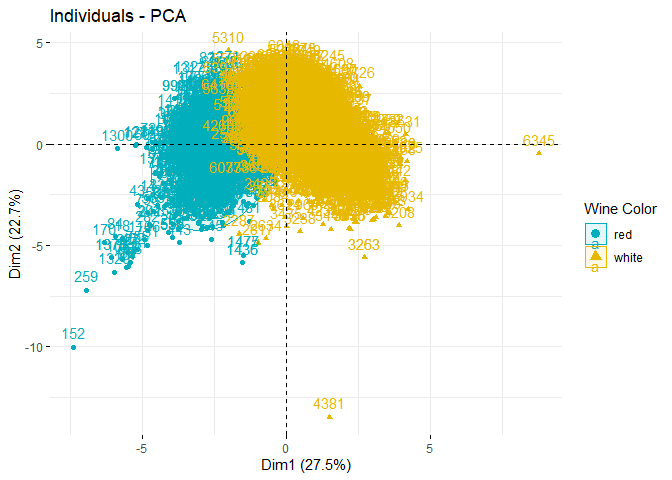

The PCA plot shows individuals represented in the space defined by the
first two principal components. The color coding represents the type of
wine, where one can clearly see a distinct grouping of red and white
wines, indicating that the PCA is able to distinguish between red and
white wines using the chemical properties alone.

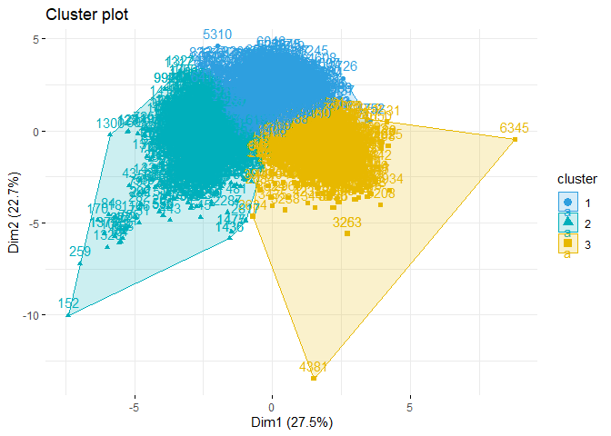

The PCA biplot adds vectors for the chemical properties, showing their
contribution to the two principal components. The separation between red
and white wines appears significant along the first principal component,
suggesting that some of these chemical properties are influential in
differentiating wine color. However, there’s no direct indication of
wine quality in this plot.

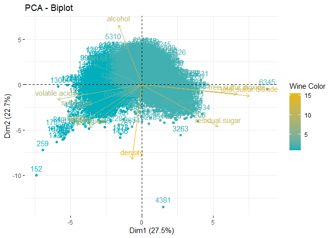

The cluster plot reveals how the data points have been grouped based on
the k-means clustering algorithm. The clusters seem to form distinct
groups, but without a clear separation that would correspond to wine
type (red vs. white). It’s less clear than the PCA if the clusters align
with wine color.

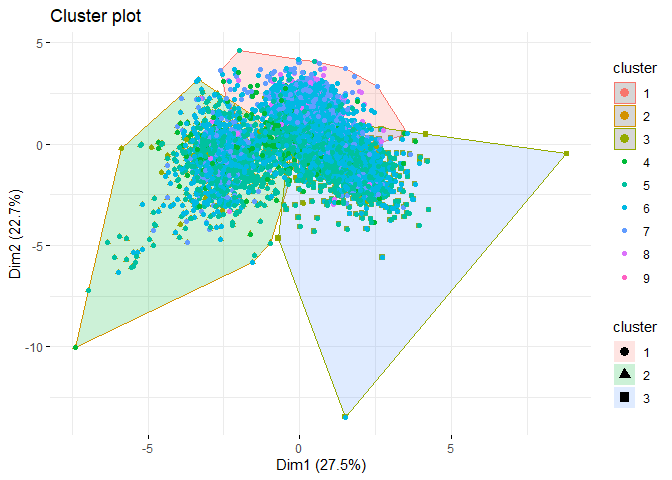

This plot shows a k-means clustering with nine clusters. It’s a bit more
difficult to interpret because the clusters are not clearly separated,
and they don’t seem to correlate with a single variable like wine color
or quality. Instead, the clusters appear to be based on more subtle
combinations of the chemical properties.

PCA outperforms other methods in distinguishing red from white wines due
to clear separation and interpretable chemical property contributions.
Quality distinction, however, is less evident, as it’s subjectively
rated and not solely dependent on chemical makeup. PCA’s effectiveness
in differentiating wine color suggests significant chemical profile
variances between red and white wines. Yet, for nuanced aspects like
quality, additional variables and advanced analysis techniques may be
necessary.

# Question 2

## Introduction and Data Cleaning

This report analyzes social media interactions from followers of the
NutrientH20 brand, using data collected over a seven-day period in June
2014. The goal is to identify distinct market segments within the social
media audience to enhance targeted marketing strategies. By examining
the categorized Twitter posts of these followers, this analysis seeks to
uncover patterns and insights that could inform more effective and
engaging marketing campaigns.

For simplicity, as part of the data cleaning process I have removed
three variables from the dataset: ‘Spam’, ‘Adult’ and ‘Uncategorized’.
The rationale for this decision is that the “Spam”, “Uncategorized”, and
“Chatter” variables will not help us in identifying and targeting
specific market segments, which is the purpose of this endeavor. While,
the “Adult” variable may be useful in identifying a specific market
segment that could be targeted on certain NSFW websites, I have removed
it in order to ensure a PG rating for this academic project.

## Initial EDA

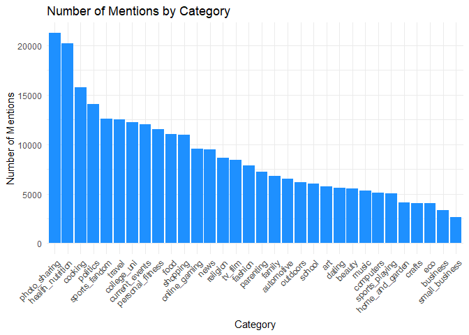

Beginning with a general preliminary data exploration, we see the number
of mentions by category in Twitter posts by NutrientH20’s followers over
the surveyed period. We can see a high volume of posts related to photo
sharing and health and nutrition, followed by cooking, politics, sports,
etc. This visualisation indicates that NurtientH20’s following tends to
be interested in a health and wellness oriented, fitness-concsious,
active lifestyle. In order to conduct a more detailed analysis and
identify market segments within the brand’s following, we will now
utilize a correlation heatmap to visualize the relationship between
categories, then use clustering to partition the brand’s folllowing into
segents based on similarities across individuals.

## Market Segmentation: Correlation Heatmap

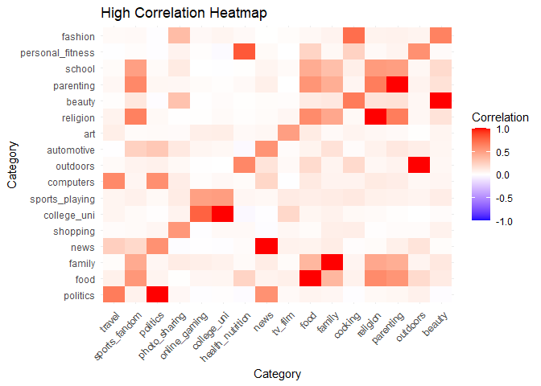 We utilized
a heatmap to visualize correlation between categories of interest as an
initial step in the segmentation process. We see the strongest
correlations between personal fitness & health and nutrition, beauty &
fashion, beauty & cooking, religion & parenting, and religion & sports
fandom (an interesting combination). Understanding these correlation
gives us a clearer picture of which categories may be linked as shared
interests, giving us a foundation for the next phase. We will now
utilize clustering to group individuals into distinct segments based on
the similarity of their interests, enabling us to craft tailored
strategies for each unique cluster.

## Market Segmentation: Clustering

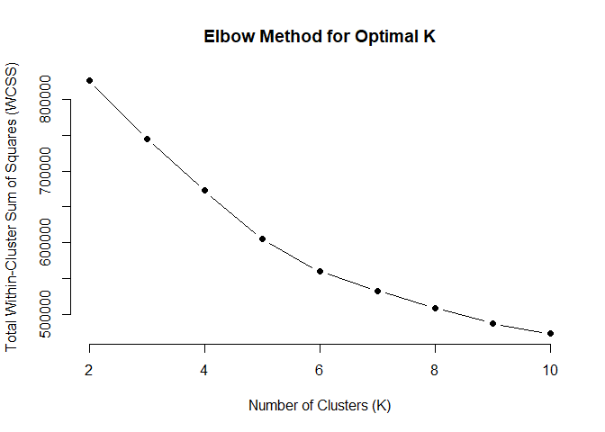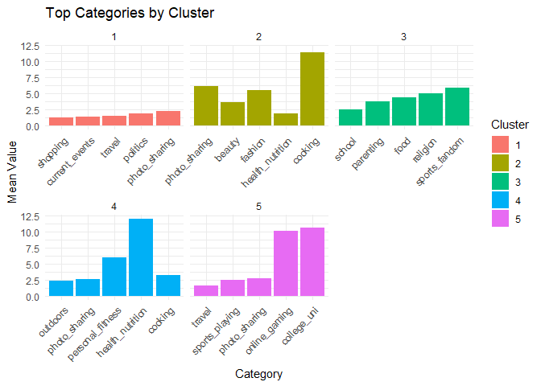

## Market Segments and Potential Target Strategies

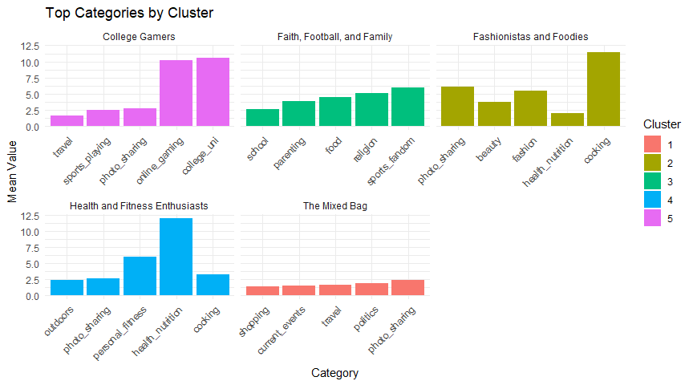

## College Gamers

The ‘College Gamers’ cluster exhibits a strong affinity towards gaming
and collegiate life. They are tech-savvy, connected, and actively
participate in online communities related to their interests.

### Marketing Strategies:

-   **Partner With Streamers** Partner with popular Twitch streamers to
    facilitate product placement.
-   **Engage with eSports:** Sponsor eSports teams and tournaments to
    advertise at events.
-   **Campus Events and Student Discounts:** Sponsor on-campus events to
    boost brand visibility.

## Health and Fitness Enthusiasts

Members of the ‘Health and Fitness Enthusiasts’ cluster are deeply
invested in their personal fitness, healthy diet, and overall active
lifestyle.

### Marketing Strategies

-   **Parnter with Fitness Influencers and Publications** Partner with
    fitness influencers and publications such as Men’s Health to boost
    brand’s reputation among health-conscious people.
-   **Release a Healthier Version:** Develop and release a healthier
    version of the product, emphasizing its low-sugar content and
    non-use of artificial dyes and coloring.
-   **Sponsor Gyms, Yoga Studios, and Community Fitness Events **
    Showcase the brand in gyms, yoga studios, and community fitness
    events (Longhorn Run!) to strengthen brand recognition and attract
    new customers who are passionate about fitness.

## Faith, Football, and Family

The ‘Faith, Football, and Family’ cluster values community, shared
experiences, and has a strong interest in sports and family-centric
activities.

### Marketing Strategies

-   **Youth Sports Sponsorships:** Sponsor local sports teams and
    tournaments, providing branded hydration stations at events. This
    highlights the beverage’s benefit to athletes while emphasizing the
    brand’s commitment to community values.
-   **Targeted Commercial Advertising:** Advertise during commercial
    breaks of major sports events, like Monday Night Football or March
    Madness.
-   **Charitable Partnerships:** Partner with religious organizations or
    charities to donate a portion of sales during specific holidays.
    Widely promote this partnership to further emphasize the brand’s
    commitment to supporting local communities.

## Fashionistas and Foodies

### Description

The ‘Fashionistas and Foodies’ cluster displayed a strong interest in
the culinary arts, beauty, and fashion, indicating that they appreciate
the finer things in life. Their significant interest in photo-sharing
indicates a proclivity for visually documenting their culinary
experiences or fasion choices.

### Marketing Strategies

-   **Influencer Partnerships:** Collaborate with fashion and food
    influencers to promote the brand by integrating the product into
    their lifestyle content narratives.
-   **Limited Edition ‘Artist Series’ Bottles:** Collaborate with
    artists to create a limited edition bottles that are visually
    stunning and collectible, then promote the bottle through notable
    influencers and celebrities in the fashion and culinary world.
-   **Paris Fashion Week: Hydration Partner** Align with Paris Fashion
    Week to become the Official Hydration Partner, featuring the ‘Artist
    Series’ bottles throughout the event.

## The Mixed Bag

The ‘Mixed Bag’ cluster presents a varied set of interests, suggesting a
demographic that is not easily categorized but is open to a wide array
of products and experiences. Versatile and wide-ranging marketing
strategies will be needed for this cluster.

### Marketing Strategies

-   **Podcast Ad Reads:** Secure advertising partnerships with a variety
    of podcasts across genres including politics, current events, and
    travel.
-   **Broad Social Media Ad Camaign:** Run a general ad campaign across
    multiple social media platforms, targeting a wide range of interests
    and demographics to maximize reach and brand visibility.

# Question 3

To mine for rules from the grocery transactions, I will first upload the
txt file “Groceries” and read it as a transaction in order for arules to
interact with it. To determine how to apply the a prior algorithm, I am
going to look at a summary of the transactions.

    ## transactions as itemMatrix in sparse format with
    ##  9835 rows (elements/itemsets/transactions) and
    ##  169 columns (items) and a density of 0.02609146 
    ## 
    ## most frequent items:
    ##       whole milk other vegetables       rolls/buns             soda 
    ##             2513             1903             1809             1715 
    ##           yogurt          (Other) 
    ##             1372            34055 
    ## 
    ## element (itemset/transaction) length distribution:
    ## sizes
    ##    1    2    3    4    5    6    7    8    9   10   11   12   13   14   15   16 
    ## 2159 1643 1299 1005  855  645  545  438  350  246  182  117   78   77   55   46 
    ##   17   18   19   20   21   22   23   24   26   27   28   29   32 
    ##   29   14   14    9   11    4    6    1    1    1    1    3    1 
    ## 
    ##    Min. 1st Qu.  Median    Mean 3rd Qu.    Max. 
    ##   1.000   2.000   3.000   4.409   6.000  32.000 
    ## 
    ## includes extended item information - examples:
    ##             labels
    ## 1 abrasive cleaner
    ## 2 artif. sweetener
    ## 3   baby cosmetics

Based on the above results, I am going to limit the length of rules to a
max length of 10. There are slightly below 10,000 transactions in the
rules, so I am going to set support at a minimum value of 0.01 and
confidence at 0.1.

This produces about 435 rules, including 8 where the lhs is an empty
subset. These rules are graphed against confidence and support, with
color varying representing lift, are shown below

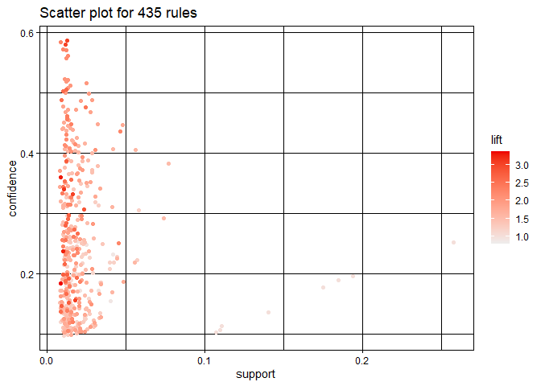

Looking at the graph, the rules with the strongest lift appear to be
between 0 &lt; support &lt; 0.05 and 0 &lt; confidence &lt; 0.6. The
lift ranges from 1 to just above 3. To hone in on more
interesting/informative rules, I am going to limit the analysis to a
subset of rules with confidence of at least 0.3 and a lift of at least
2.5, so that we are looking at the rules in the upper left part of the
above graph. I chose this because the spread of rules is more sparse, so
we may some more interesting connections. I also chose this lift to
focus on rules that provide more useful rules, since lift measures the
increases in probability of the lhs event given the rhs event.

    ##      lhs                         rhs                   support confidence   coverage     lift count
    ## [1]  {onions}                 => {other vegetables} 0.01423488  0.4590164 0.03101169 2.372268   140
    ## [2]  {berries}                => {yogurt}           0.01057448  0.3180428 0.03324860 2.279848   104
    ## [3]  {hamburger meat}         => {other vegetables} 0.01382816  0.4159021 0.03324860 2.149447   136
    ## [4]  {cream cheese}           => {yogurt}           0.01240468  0.3128205 0.03965430 2.242412   122
    ## [5]  {chicken}                => {other vegetables} 0.01789527  0.4170616 0.04290798 2.155439   176
    ## [6]  {beef}                   => {root vegetables}  0.01738688  0.3313953 0.05246568 3.040367   171
    ## [7]  {curd}                   => {yogurt}           0.01728521  0.3244275 0.05327911 2.325615   170
    ## [8]  {whipped/sour cream}     => {other vegetables} 0.02887646  0.4028369 0.07168277 2.081924   284
    ## [9]  {root vegetables}        => {other vegetables} 0.04738180  0.4347015 0.10899847 2.246605   466
    ## [10] {curd,                                                                                        
    ##       yogurt}                 => {whole milk}       0.01006609  0.5823529 0.01728521 2.279125    99
    ## [11] {curd,                                                                                        
    ##       whole milk}             => {yogurt}           0.01006609  0.3852140 0.02613116 2.761356    99
    ## [12] {pork,                                                                                        
    ##       whole milk}             => {other vegetables} 0.01016777  0.4587156 0.02216573 2.370714   100
    ## [13] {butter,                                                                                      
    ##       other vegetables}       => {whole milk}       0.01148958  0.5736041 0.02003050 2.244885   113
    ## [14] {butter,                                                                                      
    ##       whole milk}             => {other vegetables} 0.01148958  0.4169742 0.02755465 2.154987   113
    ## [15] {domestic eggs,                                                                               
    ##       other vegetables}       => {whole milk}       0.01230300  0.5525114 0.02226741 2.162336   121
    ## [16] {domestic eggs,                                                                               
    ##       whole milk}             => {other vegetables} 0.01230300  0.4101695 0.02999492 2.119820   121
    ## [17] {fruit/vegetable juice,                                                                       
    ##       whole milk}             => {other vegetables} 0.01047280  0.3931298 0.02663955 2.031756   103
    ## [18] {whipped/sour cream,                                                                          
    ##       yogurt}                 => {other vegetables} 0.01016777  0.4901961 0.02074225 2.533410   100
    ## [19] {other vegetables,                                                                            
    ##       whipped/sour cream}     => {yogurt}           0.01016777  0.3521127 0.02887646 2.524073   100
    ## [20] {whipped/sour cream,                                                                          
    ##       yogurt}                 => {whole milk}       0.01087951  0.5245098 0.02074225 2.052747   107
    ## [21] {whipped/sour cream,                                                                          
    ##       whole milk}             => {yogurt}           0.01087951  0.3375394 0.03223183 2.419607   107
    ## [22] {whipped/sour cream,                                                                          
    ##       whole milk}             => {other vegetables} 0.01464159  0.4542587 0.03223183 2.347679   144
    ## [23] {other vegetables,                                                                            
    ##       pip fruit}              => {whole milk}       0.01352313  0.5175097 0.02613116 2.025351   133
    ## [24] {pip fruit,                                                                                   
    ##       whole milk}             => {other vegetables} 0.01352313  0.4493243 0.03009659 2.322178   133
    ## [25] {citrus fruit,                                                                                
    ##       root vegetables}        => {other vegetables} 0.01037112  0.5862069 0.01769192 3.029608   102
    ## [26] {citrus fruit,                                                                                
    ##       other vegetables}       => {root vegetables}  0.01037112  0.3591549 0.02887646 3.295045   102
    ## [27] {citrus fruit,                                                                                
    ##       whole milk}             => {yogurt}           0.01026945  0.3366667 0.03050330 2.413350   101
    ## [28] {citrus fruit,                                                                                
    ##       whole milk}             => {other vegetables} 0.01301474  0.4266667 0.03050330 2.205080   128
    ## [29] {root vegetables,                                                                             
    ##       tropical fruit}         => {other vegetables} 0.01230300  0.5845411 0.02104728 3.020999   121
    ## [30] {other vegetables,                                                                            
    ##       tropical fruit}         => {root vegetables}  0.01230300  0.3427762 0.03589222 3.144780   121
    ## [31] {root vegetables,                                                                             
    ##       tropical fruit}         => {whole milk}       0.01199797  0.5700483 0.02104728 2.230969   118
    ## [32] {tropical fruit,                                                                              
    ##       yogurt}                 => {other vegetables} 0.01230300  0.4201389 0.02928317 2.171343   121
    ## [33] {other vegetables,                                                                            
    ##       tropical fruit}         => {yogurt}           0.01230300  0.3427762 0.03589222 2.457146   121
    ## [34] {tropical fruit,                                                                              
    ##       yogurt}                 => {whole milk}       0.01514997  0.5173611 0.02928317 2.024770   149
    ## [35] {tropical fruit,                                                                              
    ##       whole milk}             => {yogurt}           0.01514997  0.3581731 0.04229792 2.567516   149
    ## [36] {tropical fruit,                                                                              
    ##       whole milk}             => {other vegetables} 0.01708185  0.4038462 0.04229792 2.087140   168
    ## [37] {root vegetables,                                                                             
    ##       yogurt}                 => {other vegetables} 0.01291307  0.5000000 0.02582613 2.584078   127
    ## [38] {root vegetables,                                                                             
    ##       yogurt}                 => {whole milk}       0.01453991  0.5629921 0.02582613 2.203354   143
    ## [39] {rolls/buns,                                                                                  
    ##       root vegetables}        => {other vegetables} 0.01220132  0.5020921 0.02430097 2.594890   120
    ## [40] {rolls/buns,                                                                                  
    ##       root vegetables}        => {whole milk}       0.01270971  0.5230126 0.02430097 2.046888   125
    ## [41] {root vegetables,                                                                             
    ##       whole milk}             => {other vegetables} 0.02318251  0.4740125 0.04890696 2.449770   228
    ## [42] {other vegetables,                                                                            
    ##       whole milk}             => {root vegetables}  0.02318251  0.3097826 0.07483477 2.842082   228
    ## [43] {other vegetables,                                                                            
    ##       yogurt}                 => {whole milk}       0.02226741  0.5128806 0.04341637 2.007235   219
    ## [44] {whole milk,                                                                                  
    ##       yogurt}                 => {other vegetables} 0.02226741  0.3974592 0.05602440 2.054131   219

This rule mining found some interesting relationships. For example,
{citrus fruit, other vegetables} =&gt; {root vegetables} has a lift of
3.295 and a confidence of 0.359. Although root vegetables only occur
with a 0.359 probability given a transaction contains citrus and other
fruit, its probability increases by more than 3 times given that event
occurs. and {other vegetables, tropical fruit} =&gt; {root vegetables}
has a lift of 3.144 and a confidence of about 0.343. These connections
also make sense. For example, the rule {beef} =&gt; {root vegetables}
has a relatively strong lift compared to the rest of the rules, coming
in at 3.04. Considering that beef is often cooked with root vegetables
like carrots (such as in stews or pot roasts). Furthermore, several
rules show relationships between dairy products and fruit products (such
as between curds and yogurt, or vegetables and butter). Finally, I am
going to visualize the relationship between the goods in the
transactions using Gephi.

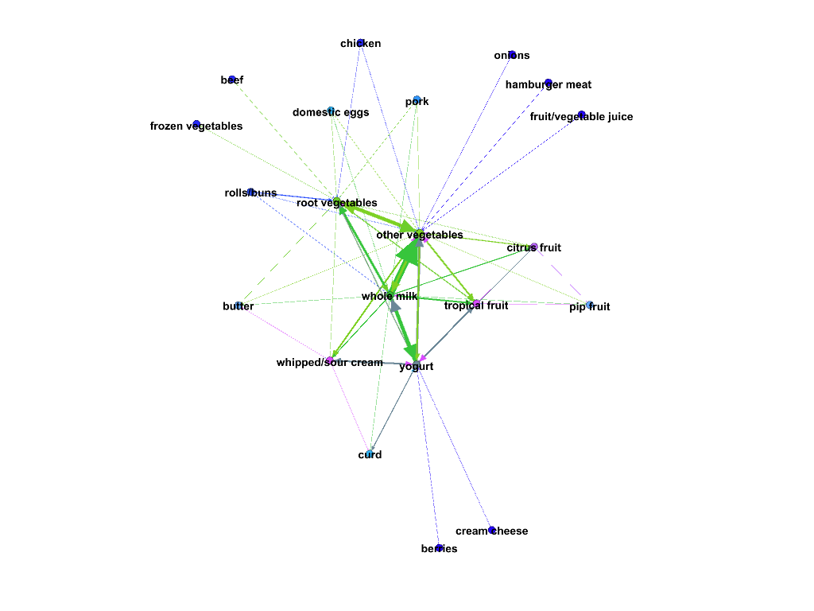

As can be seen, the most connected items in the transactions I filtered
for are root vegetables, whole milk, and other vegetables. The most
peripheral are berries and cream cheese, their only connection being
with yogurt.

# Question 4

## Model Training

To train the classification model, I will set the batch size to 4 and
train a CNN with 4 training epochs on the training set using PyTorch. I
will measure the model performance by the finding the proportion of
images it correctly classifies out of the entire set. The loss function
will be CrossEntropyLoss.() and the optimizer function
optim.Adam(net.parameters()).

## Model Testing

Now that the model is completed, we will test it on the test set.

    ## Accuracy on the test set: 75.09%

Finally, we will find the model’s confusion matrix. Predicted labels run
along the x axis and actual labels along the y axis.

    ## <Figure size 1000x800 with 0 Axes>

    ## <Axes: >

    ## Text(0.5, 58.7222222222222, 'Predicted labels')

    ## Text(95.7222222222222, 0.5, 'Actual labels')

    ## Text(0.5, 1.0, 'Confusion Matrix')

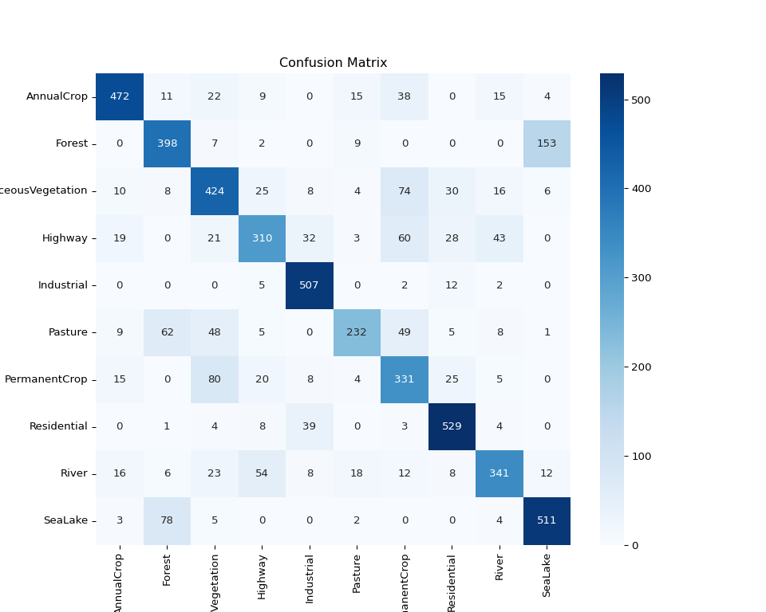

As can be seen above, the majority of incorrectly identified classes are
in the double digits. However, there were 153 cases where Forest
was predicted and the actual value was SeaLake.
