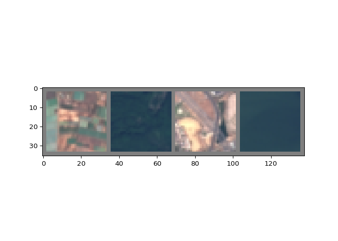
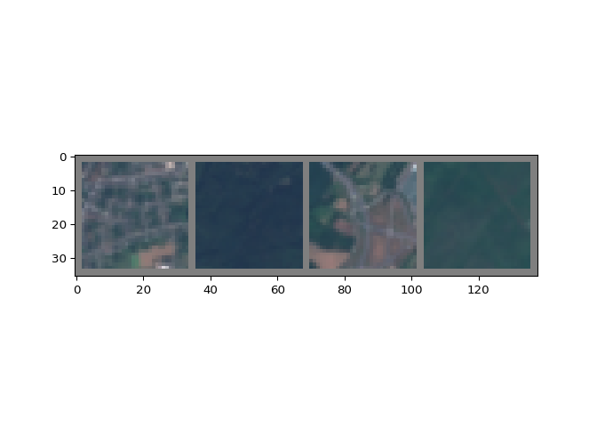
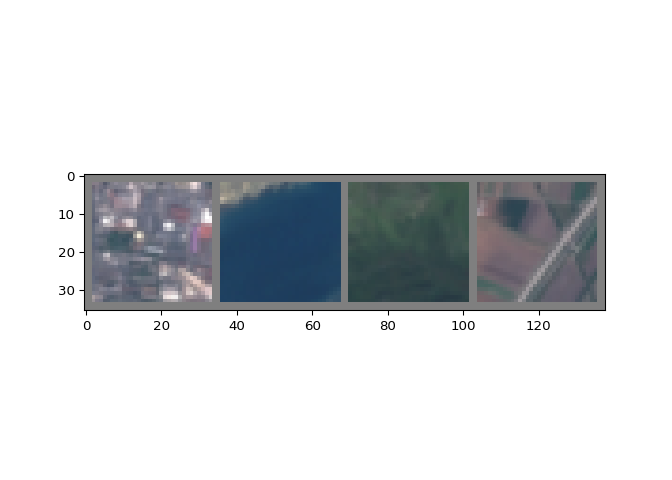

 The PCA
plot shows individuals represented in the space defined by the first two
principal components. The color coding represents the type of wine,
where one can clearly see a distinct grouping of red and white wines,
indicating that the PCA is able to distinguish between red and white
wines using the chemical properties alone.
 The PCA
biplot adds vectors for the chemical properties, showing their
contribution to the two principal components. The separation between red
and white wines appears significant along the first principal component,
suggesting that some of these chemical properties are influential in
differentiating wine color. However, there’s no direct indication of
wine quality in this plot
 he cluster
plot reveals how the data points have been grouped based on the k-means
clustering algorithm. The clusters seem to form distinct groups, but
without a clear separation that would correspond to wine type (red
vs. white). It’s less clear than the PCA if the clusters align with wine
color.  This
plot shows a k-means clustering with nine clusters. It’s a bit more
difficult to interpret because the clusters are not clearly separated,
and they don’t seem to correlate with a single variable like wine color
or quality. Instead, the clusters appear to be based on more subtle
combinations of the chemical properties.

PCA outperforms other methods in distinguishing red from white wines due
to clear separation and interpretable chemical property contributions.
Quality distinction, however, is less evident, as it’s subjectively
rated and not solely dependent on chemical makeup. PCA’s effectiveness
in differentiating wine color suggests significant chemical profile
variances between red and white wines. Yet, for nuanced aspects like
quality, additional variables and advanced analysis techniques may be
necessary.

# Question 2

## Introduction and Data Cleaning

This report analyzes social media interactions from followers of the
NutrientH20 brand, using data collected over a seven-day period in June
2014. The goal is to identify distinct market segments within the social
media audience to enhance targeted marketing strategies. By examining
the categorized Twitter posts of these followers, this analysis seeks to
uncover patterns and insights that could inform more effective and
engaging marketing campaigns.

For simplicity, as part of the data cleaning process I have removed
three variables from the dataset: ‘Spam’, ‘Adult’ and ‘Uncategorized’.
The rationale for this decision is that the “Spam”, “Uncategorized”, and
“Chatter” variables will not help us in identifying and targeting
specific market segments, which is the purpose of this endeavor. While,
the “Adult” variable may be useful in identifying a specific market
segment that could be targeted on certain NSFW websites, I have removed
it in order to ensure a PG rating for this academic project.

## Initial EDA

Beginning with a general preliminary data exploration, we see the number
of mentions by category in Twitter posts by NutrientH20’s followers over
the surveyed period. We can see a high volume of posts related to photo
sharing and health and nutrition, followed by cooking, politics, sports,
etc. This visualisation indicates that NurtientH20’s following tends to
be interested in a health and wellness oriented, fitness-concsious,
active lifestyle. In order to conduct a more detailed analysis and
identify market segments within the brand’s following, we will now
utilize a correlation heatmap to visualize the relationship between
categories, then use clustering to partition the brand’s folllowing into
segents based on similarities across individuals.

## Market Segmentation: Correlation Heatmap

 We utilized
a heatmap to visualize correlation between categories of interest as an
initial step in the segmentation process. We see the strongest
correlations between personal fitness & health and nutrition, beauty &
fashion, beauty & cooking, religion & parenting, and religion & sports
fandom (an interesting combination). Understanding these correlation
gives us a clearer picture of which categories may be linked as shared
interests, giving us a foundation for the next phase. We will now
utilize clustering to group individuals into distinct segments based on
the similarity of their interests, enabling us to craft tailored
strategies for each unique cluster.

## Market Segmentation: Clustering

## Market Segments and Potential Target Strategies

## College Gamers

The ‘College Gamers’ cluster exhibits a strong affinity towards gaming
and collegiate life. They are tech-savvy, connected, and actively
participate in online communities related to their interests.

### Marketing Strategies:

-   **Partner With Streamers** Partner with popular Twitch streamers to
    facilitate product placement.
-   **Engage with eSports:** Sponsor eSports teams and tournaments to
    advertise at events.
-   **Campus Events and Student Discounts:** Sponsor on-campus events to
    boost brand visibility.

## Health and Fitness Enthusiasts

Members of the ‘Health and Fitness Enthusiasts’ cluster are deeply
invested in their personal fitness, healthy diet, and overall active
lifestyle.

### Marketing Strategies

-   **Parnter with Fitness Influencers and Publications** Partner with
    fitness influencers and publications such as Men’s Health to boost
    brand’s reputation among health-conscious people.
-   **Release a Healthier Version:** Develop and release a healthier
    version of the product, emphasizing its low-sugar content and
    non-use of artificial dyes and coloring.
-   **Sponsor Gyms, Yoga Studios, and Community Fitness Events **
    Showcase the brand in gyms, yoga studios, and community fitness
    events (Longhorn Run!) to strengthen brand recognition and attract
    new customers who are passionate about fitness.

## Faith, Football, and Family

The ‘Faith, Football, and Family’ cluster values community, shared
experiences, and has a strong interest in sports and family-centric
activities.

### Marketing Strategies

-   **Youth Sports Sponsorships:** Sponsor local sports teams and
    tournaments, providing branded hydration stations at events. This
    highlights the beverage’s benefit to athletes while emphasizing the
    brand’s commitment to community values.
-   **Targeted Commercial Advertising:** Advertise during commercial
    breaks of major sports events, like Monday Night Football or March
    Madness.
-   **Charitable Partnerships:** Partner with religious organizations or
    charities to donate a portion of sales during specific holidays.
    Widely promote this partnership to further emphasize the brand’s
    commitment to supporting local communities.

## Fashionistas and Foodies

### Description

The ‘Fashionistas and Foodies’ cluster displayed a strong interest in
the culinary arts, beauty, and fashion, indicating that they appreciate
the finer things in life. Their significant interest in photo-sharing
indicates a proclivity for visually documenting their culinary
experiences or fasion choices.

### Marketing Strategies

-   **Influencer Partnerships:** Collaborate with fashion and food
    influencers to promote the brand by integrating the product into
    their lifestyle content narratives.
-   **Limited Edition ‘Artist Series’ Bottles:** Collaborate with
    artists to create a limited edition bottles that are visually
    stunning and collectible, then promote the bottle through notable
    influencers and celebrities in the fashion and culinary world.
-   **Paris Fashion Week: Hydration Partner** Align with Paris Fashion
    Week to become the Official Hydration Partner, featuring the ‘Artist
    Series’ bottles throughout the event.

## The Mixed Bag

The ‘Mixed Bag’ cluster presents a varied set of interests, suggesting a
demographic that is not easily categorized but is open to a wide array
of products and experiences. Versatile and wide-ranging marketing
strategies will be needed for this cluster.

### Marketing Strategies

-   **Podcast Ad Reads:** Secure advertising partnerships with a variety
    of podcasts across genres including politics, current events, and
    travel.
-   **Broad Social Media Ad Camaign:** Run a general ad campaign across
    multiple social media platforms, targeting a wide range of interests
    and demographics to maximize reach and brand visibility.

# Question 3

To mine for rules from the grocery transactions, I will first upload the
txt file “Groceries” and read it as a transaction in order for arules to
interact with it. To determine how to apply the a prior algorithm, I am
going to look at a summary of the transactions.

    ## transactions as itemMatrix in sparse format with
    ##  9835 rows (elements/itemsets/transactions) and
    ##  169 columns (items) and a density of 0.02609146 
    ## 
    ## most frequent items:
    ##       whole milk other vegetables       rolls/buns             soda 
    ##             2513             1903             1809             1715 
    ##           yogurt          (Other) 
    ##             1372            34055 
    ## 
    ## element (itemset/transaction) length distribution:
    ## sizes
    ##    1    2    3    4    5    6    7    8    9   10   11   12   13   14   15   16 
    ## 2159 1643 1299 1005  855  645  545  438  350  246  182  117   78   77   55   46 
    ##   17   18   19   20   21   22   23   24   26   27   28   29   32 
    ##   29   14   14    9   11    4    6    1    1    1    1    3    1 
    ## 
    ##    Min. 1st Qu.  Median    Mean 3rd Qu.    Max. 
    ##   1.000   2.000   3.000   4.409   6.000  32.000 
    ## 
    ## includes extended item information - examples:
    ##             labels
    ## 1 abrasive cleaner
    ## 2 artif. sweetener
    ## 3   baby cosmetics

Based on the above results, I am going to limit the length of rules to a
max length of 10. There are slightly below 10,000 transactions in the
rules, so I am going to set support at a minimum value of 0.01 and
confidence at 0.1.

    ##       lhs                           rhs                        support confidence   coverage      lift count
    ## [1]   {}                         => {bottled water}         0.11052364  0.1105236 1.00000000 1.0000000  1087
    ## [2]   {}                         => {tropical fruit}        0.10493137  0.1049314 1.00000000 1.0000000  1032
    ## [3]   {}                         => {root vegetables}       0.10899847  0.1089985 1.00000000 1.0000000  1072
    ## [4]   {}                         => {soda}                  0.17437722  0.1743772 1.00000000 1.0000000  1715
    ## [5]   {}                         => {yogurt}                0.13950178  0.1395018 1.00000000 1.0000000  1372
    ## [6]   {}                         => {rolls/buns}            0.18393493  0.1839349 1.00000000 1.0000000  1809
    ## [7]   {}                         => {other vegetables}      0.19349263  0.1934926 1.00000000 1.0000000  1903
    ## [8]   {}                         => {whole milk}            0.25551601  0.2555160 1.00000000 1.0000000  2513
    ## [9]   {hard cheese}              => {whole milk}            0.01006609  0.4107884 0.02450432 1.6076815    99
    ## [10]  {butter milk}              => {other vegetables}      0.01037112  0.3709091 0.02796136 1.9169159   102
    ## [11]  {butter milk}              => {whole milk}            0.01159126  0.4145455 0.02796136 1.6223854   114
    ## [12]  {ham}                      => {whole milk}            0.01148958  0.4414062 0.02602949 1.7275091   113
    ## [13]  {sliced cheese}            => {whole milk}            0.01077783  0.4398340 0.02450432 1.7213560   106
    ## [14]  {oil}                      => {whole milk}            0.01128622  0.4021739 0.02806304 1.5739675   111
    ## [15]  {onions}                   => {other vegetables}      0.01423488  0.4590164 0.03101169 2.3722681   140
    ## [16]  {onions}                   => {whole milk}            0.01209964  0.3901639 0.03101169 1.5269647   119
    ## [17]  {berries}                  => {yogurt}                0.01057448  0.3180428 0.03324860 2.2798477   104
    ## [18]  {berries}                  => {other vegetables}      0.01026945  0.3088685 0.03324860 1.5962805   101
    ## [19]  {berries}                  => {whole milk}            0.01179461  0.3547401 0.03324860 1.3883281   116
    ## [20]  {hamburger meat}           => {other vegetables}      0.01382816  0.4159021 0.03324860 2.1494470   136
    ## [21]  {hamburger meat}           => {whole milk}            0.01474326  0.4434251 0.03324860 1.7354101   145
    ## [22]  {hygiene articles}         => {whole milk}            0.01281139  0.3888889 0.03294357 1.5219746   126
    ## [23]  {salty snack}              => {other vegetables}      0.01077783  0.2849462 0.03782410 1.4726465   106
    ## [24]  {salty snack}              => {whole milk}            0.01118454  0.2956989 0.03782410 1.1572618   110
    ## [25]  {sugar}                    => {other vegetables}      0.01077783  0.3183183 0.03385867 1.6451186   106
    ## [26]  {sugar}                    => {whole milk}            0.01504830  0.4444444 0.03385867 1.7393996   148
    ## [27]  {waffles}                  => {other vegetables}      0.01006609  0.2619048 0.03843416 1.3535645    99
    ## [28]  {waffles}                  => {whole milk}            0.01270971  0.3306878 0.03843416 1.2941961   125
    ## [29]  {long life bakery product} => {other vegetables}      0.01067616  0.2853261 0.03741739 1.4746096   105
    ## [30]  {long life bakery product} => {whole milk}            0.01352313  0.3614130 0.03741739 1.4144438   133
    ## [31]  {dessert}                  => {other vegetables}      0.01159126  0.3123288 0.03711235 1.6141636   114
    ## [32]  {dessert}                  => {whole milk}            0.01372649  0.3698630 0.03711235 1.4475140   135
    ## [33]  {canned beer}              => {shopping bags}         0.01138790  0.1465969 0.07768175 1.4879052   112
    ## [34]  {shopping bags}            => {canned beer}           0.01138790  0.1155831 0.09852567 1.4879052   112
    ## [35]  {canned beer}              => {soda}                  0.01382816  0.1780105 0.07768175 1.0208356   136
    ## [36]  {canned beer}              => {rolls/buns}            0.01128622  0.1452880 0.07768175 0.7898878   111
    ## [37]  {cream cheese}             => {yogurt}                0.01240468  0.3128205 0.03965430 2.2424123   122
    ## [38]  {cream cheese}             => {other vegetables}      0.01372649  0.3461538 0.03965430 1.7889769   135
    ## [39]  {cream cheese}             => {whole milk}            0.01647178  0.4153846 0.03965430 1.6256696   162
    ## [40]  {chicken}                  => {root vegetables}       0.01087951  0.2535545 0.04290798 2.3262206   107
    ## [41]  {chicken}                  => {other vegetables}      0.01789527  0.4170616 0.04290798 2.1554393   176
    ## [42]  {chicken}                  => {whole milk}            0.01759024  0.4099526 0.04290798 1.6044106   173
    ## [43]  {white bread}              => {soda}                  0.01026945  0.2439614 0.04209456 1.3990437   101
    ## [44]  {white bread}              => {other vegetables}      0.01372649  0.3260870 0.04209456 1.6852681   135
    ## [45]  {white bread}              => {whole milk}            0.01708185  0.4057971 0.04209456 1.5881474   168
    ## [46]  {chocolate}                => {soda}                  0.01352313  0.2725410 0.04961871 1.5629391   133
    ## [47]  {chocolate}                => {rolls/buns}            0.01179461  0.2377049 0.04961871 1.2923316   116
    ## [48]  {chocolate}                => {other vegetables}      0.01270971  0.2561475 0.04961871 1.3238103   125
    ## [49]  {chocolate}                => {whole milk}            0.01667514  0.3360656 0.04961871 1.3152427   164
    ## [50]  {coffee}                   => {rolls/buns}            0.01098119  0.1891419 0.05805796 1.0283085   108
    ## [51]  {coffee}                   => {other vegetables}      0.01342145  0.2311734 0.05805796 1.1947400   132
    ## [52]  {coffee}                   => {whole milk}            0.01870869  0.3222417 0.05805796 1.2611408   184
    ## [53]  {frozen vegetables}        => {root vegetables}       0.01159126  0.2410148 0.04809354 2.2111759   114
    ## [54]  {root vegetables}          => {frozen vegetables}     0.01159126  0.1063433 0.10899847 2.2111759   114
    ## [55]  {frozen vegetables}        => {yogurt}                0.01240468  0.2579281 0.04809354 1.8489235   122
    ## [56]  {frozen vegetables}        => {rolls/buns}            0.01016777  0.2114165 0.04809354 1.1494092   100
    ## [57]  {frozen vegetables}        => {other vegetables}      0.01779359  0.3699789 0.04809354 1.9121083   175
    ## [58]  {frozen vegetables}        => {whole milk}            0.02043721  0.4249471 0.04809354 1.6630940   201
    ## [59]  {beef}                     => {root vegetables}       0.01738688  0.3313953 0.05246568 3.0403668   171
    ## [60]  {root vegetables}          => {beef}                  0.01738688  0.1595149 0.10899847 3.0403668   171
    ## [61]  {beef}                     => {yogurt}                0.01169293  0.2228682 0.05246568 1.5976012   115
    ## [62]  {beef}                     => {rolls/buns}            0.01362481  0.2596899 0.05246568 1.4118576   134
    ## [63]  {beef}                     => {other vegetables}      0.01972547  0.3759690 0.05246568 1.9430662   194
    ## [64]  {other vegetables}         => {beef}                  0.01972547  0.1019443 0.19349263 1.9430662   194
    ## [65]  {beef}                     => {whole milk}            0.02125064  0.4050388 0.05246568 1.5851795   209
    ## [66]  {curd}                     => {whipped/sour cream}    0.01047280  0.1965649 0.05327911 2.7421499   103
    ## [67]  {whipped/sour cream}       => {curd}                  0.01047280  0.1460993 0.07168277 2.7421499   103
    ## [68]  {curd}                     => {tropical fruit}        0.01026945  0.1927481 0.05327911 1.8368968   101
    ## [69]  {curd}                     => {root vegetables}       0.01087951  0.2041985 0.05327911 1.8734067   107
    ## [70]  {curd}                     => {yogurt}                0.01728521  0.3244275 0.05327911 2.3256154   170
    ## [71]  {yogurt}                   => {curd}                  0.01728521  0.1239067 0.13950178 2.3256154   170
    ## [72]  {curd}                     => {rolls/buns}            0.01006609  0.1889313 0.05327911 1.0271638    99
    ## [73]  {curd}                     => {other vegetables}      0.01718353  0.3225191 0.05327911 1.6668288   169
    ## [74]  {curd}                     => {whole milk}            0.02613116  0.4904580 0.05327911 1.9194805   257
    ## [75]  {whole milk}               => {curd}                  0.02613116  0.1022682 0.25551601 1.9194805   257
    ## [76]  {napkins}                  => {tropical fruit}        0.01006609  0.1922330 0.05236401 1.8319880    99
    ## [77]  {napkins}                  => {soda}                  0.01199797  0.2291262 0.05236401 1.3139687   118
    ## [78]  {napkins}                  => {yogurt}                0.01230300  0.2349515 0.05236401 1.6842183   121
    ## [79]  {napkins}                  => {rolls/buns}            0.01169293  0.2233010 0.05236401 1.2140216   115
    ## [80]  {napkins}                  => {other vegetables}      0.01443823  0.2757282 0.05236401 1.4250060   142
    ## [81]  {napkins}                  => {whole milk}            0.01972547  0.3766990 0.05236401 1.4742678   194
    ## [82]  {pork}                     => {root vegetables}       0.01362481  0.2363316 0.05765125 2.1682099   134
    ## [83]  {root vegetables}          => {pork}                  0.01362481  0.1250000 0.10899847 2.1682099   134
    ## [84]  {pork}                     => {soda}                  0.01189629  0.2063492 0.05765125 1.1833495   117
    ## [85]  {pork}                     => {rolls/buns}            0.01128622  0.1957672 0.05765125 1.0643286   111
    ## [86]  {pork}                     => {other vegetables}      0.02165735  0.3756614 0.05765125 1.9414764   213
    ## [87]  {other vegetables}         => {pork}                  0.02165735  0.1119285 0.19349263 1.9414764   213
    ## [88]  {pork}                     => {whole milk}            0.02216573  0.3844797 0.05765125 1.5047187   218
    ## [89]  {frankfurter}              => {sausage}               0.01006609  0.1706897 0.05897306 1.8168103    99
    ## [90]  {sausage}                  => {frankfurter}           0.01006609  0.1071429 0.09395018 1.8168103    99
    ## [91]  {frankfurter}              => {root vegetables}       0.01016777  0.1724138 0.05897306 1.5818001   100
    ## [92]  {frankfurter}              => {soda}                  0.01128622  0.1913793 0.05897306 1.0975018   111
    ## [93]  {frankfurter}              => {yogurt}                0.01118454  0.1896552 0.05897306 1.3595179   110
    ## [94]  {frankfurter}              => {rolls/buns}            0.01921708  0.3258621 0.05897306 1.7716161   189
    ## [95]  {rolls/buns}               => {frankfurter}           0.01921708  0.1044776 0.18393493 1.7716161   189
    ## [96]  {frankfurter}              => {other vegetables}      0.01647178  0.2793103 0.05897306 1.4435193   162
    ## [97]  {frankfurter}              => {whole milk}            0.02053889  0.3482759 0.05897306 1.3630295   202
    ## [98]  {bottled beer}             => {bottled water}         0.01576004  0.1957071 0.08052872 1.7707259   155
    ## [99]  {bottled water}            => {bottled beer}          0.01576004  0.1425943 0.11052364 1.7707259   155
    ## [100] {bottled beer}             => {soda}                  0.01698017  0.2108586 0.08052872 1.2092094   167
    ## [101] {bottled beer}             => {rolls/buns}            0.01362481  0.1691919 0.08052872 0.9198466   134
    ## [102] {bottled beer}             => {other vegetables}      0.01616675  0.2007576 0.08052872 1.0375464   159
    ## [103] {bottled beer}             => {whole milk}            0.02043721  0.2537879 0.08052872 0.9932367   201
    ## [104] {brown bread}              => {sausage}               0.01067616  0.1645768 0.06487036 1.7517455   105
    ## [105] {sausage}                  => {brown bread}           0.01067616  0.1136364 0.09395018 1.7517455   105
    ## [106] {brown bread}              => {tropical fruit}        0.01067616  0.1645768 0.06487036 1.5684233   105
    ## [107] {tropical fruit}           => {brown bread}           0.01067616  0.1017442 0.10493137 1.5684233   105
    ## [108] {brown bread}              => {root vegetables}       0.01016777  0.1567398 0.06487036 1.4380000   100
    ## [109] {brown bread}              => {soda}                  0.01260803  0.1943574 0.06487036 1.1145800   124
    ## [110] {brown bread}              => {yogurt}                0.01453991  0.2241379 0.06487036 1.6067030   143
    ## [111] {yogurt}                   => {brown bread}           0.01453991  0.1042274 0.13950178 1.6067030   143
    ## [112] {brown bread}              => {rolls/buns}            0.01260803  0.1943574 0.06487036 1.0566637   124
    ## [113] {brown bread}              => {other vegetables}      0.01870869  0.2884013 0.06487036 1.4905025   184
    ## [114] {brown bread}              => {whole milk}            0.02521607  0.3887147 0.06487036 1.5212930   248
    ## [115] {margarine}                => {bottled water}         0.01026945  0.1753472 0.05856634 1.5865133   101
    ## [116] {margarine}                => {root vegetables}       0.01108287  0.1892361 0.05856634 1.7361354   109
    ## [117] {root vegetables}          => {margarine}             0.01108287  0.1016791 0.10899847 1.7361354   109
    ## [118] {margarine}                => {soda}                  0.01016777  0.1736111 0.05856634 0.9956066   100
    ## [119] {margarine}                => {yogurt}                0.01423488  0.2430556 0.05856634 1.7423115   140
    ## [120] {yogurt}                   => {margarine}             0.01423488  0.1020408 0.13950178 1.7423115   140
    ## [121] {margarine}                => {rolls/buns}            0.01474326  0.2517361 0.05856634 1.3686151   145
    ## [122] {margarine}                => {other vegetables}      0.01972547  0.3368056 0.05856634 1.7406635   194
    ## [123] {other vegetables}         => {margarine}             0.01972547  0.1019443 0.19349263 1.7406635   194
    ## [124] {margarine}                => {whole milk}            0.02419929  0.4131944 0.05856634 1.6170980   238
    ## [125] {butter}                   => {whipped/sour cream}    0.01016777  0.1834862 0.05541434 2.5596981   100
    ## [126] {whipped/sour cream}       => {butter}                0.01016777  0.1418440 0.07168277 2.5596981   100
    ## [127] {butter}                   => {root vegetables}       0.01291307  0.2330275 0.05541434 2.1378971   127
    ## [128] {root vegetables}          => {butter}                0.01291307  0.1184701 0.10899847 2.1378971   127
    ## [129] {butter}                   => {yogurt}                0.01464159  0.2642202 0.05541434 1.8940273   144
    ## [130] {yogurt}                   => {butter}                0.01464159  0.1049563 0.13950178 1.8940273   144
    ## [131] {butter}                   => {rolls/buns}            0.01342145  0.2422018 0.05541434 1.3167800   132
    ## [132] {butter}                   => {other vegetables}      0.02003050  0.3614679 0.05541434 1.8681223   197
    ## [133] {other vegetables}         => {butter}                0.02003050  0.1035208 0.19349263 1.8681223   197
    ## [134] {butter}                   => {whole milk}            0.02755465  0.4972477 0.05541434 1.9460530   271
    ## [135] {whole milk}               => {butter}                0.02755465  0.1078392 0.25551601 1.9460530   271
    ## [136] {newspapers}               => {bottled water}         0.01128622  0.1414013 0.07981698 1.2793758   111
    ## [137] {bottled water}            => {newspapers}            0.01128622  0.1021159 0.11052364 1.2793758   111
    ## [138] {newspapers}               => {tropical fruit}        0.01179461  0.1477707 0.07981698 1.4082605   116
    ## [139] {tropical fruit}           => {newspapers}            0.01179461  0.1124031 0.10493137 1.4082605   116
    ## [140] {newspapers}               => {root vegetables}       0.01148958  0.1439490 0.07981698 1.3206519   113
    ## [141] {root vegetables}          => {newspapers}            0.01148958  0.1054104 0.10899847 1.3206519   113
    ## [142] {newspapers}               => {soda}                  0.01464159  0.1834395 0.07981698 1.0519693   144
    ## [143] {newspapers}               => {yogurt}                0.01535333  0.1923567 0.07981698 1.3788834   151
    ## [144] {yogurt}                   => {newspapers}            0.01535333  0.1100583 0.13950178 1.3788834   151
    ## [145] {newspapers}               => {rolls/buns}            0.01972547  0.2471338 0.07981698 1.3435934   194
    ## [146] {rolls/buns}               => {newspapers}            0.01972547  0.1072416 0.18393493 1.3435934   194
    ## [147] {newspapers}               => {other vegetables}      0.01931876  0.2420382 0.07981698 1.2508912   190
    ## [148] {newspapers}               => {whole milk}            0.02735130  0.3426752 0.07981698 1.3411103   269
    ## [149] {whole milk}               => {newspapers}            0.02735130  0.1070434 0.25551601 1.3411103   269
    ## [150] {domestic eggs}            => {citrus fruit}          0.01037112  0.1634615 0.06344687 1.9749929   102
    ## [151] {citrus fruit}             => {domestic eggs}         0.01037112  0.1253071 0.08276563 1.9749929   102
    ## [152] {domestic eggs}            => {tropical fruit}        0.01138790  0.1794872 0.06344687 1.7105198   112
    ## [153] {tropical fruit}           => {domestic eggs}         0.01138790  0.1085271 0.10493137 1.7105198   112
    ## [154] {domestic eggs}            => {root vegetables}       0.01433655  0.2259615 0.06344687 2.0730706   141
    ## [155] {root vegetables}          => {domestic eggs}         0.01433655  0.1315299 0.10899847 2.0730706   141
    ## [156] {domestic eggs}            => {soda}                  0.01240468  0.1955128 0.06344687 1.1212062   122
    ## [157] {domestic eggs}            => {yogurt}                0.01433655  0.2259615 0.06344687 1.6197753   141
    ## [158] {yogurt}                   => {domestic eggs}         0.01433655  0.1027697 0.13950178 1.6197753   141
    ## [159] {domestic eggs}            => {rolls/buns}            0.01565836  0.2467949 0.06344687 1.3417510   154
    ## [160] {domestic eggs}            => {other vegetables}      0.02226741  0.3509615 0.06344687 1.8138238   219
    ## [161] {other vegetables}         => {domestic eggs}         0.02226741  0.1150815 0.19349263 1.8138238   219
    ## [162] {domestic eggs}            => {whole milk}            0.02999492  0.4727564 0.06344687 1.8502027   295
    ## [163] {whole milk}               => {domestic eggs}         0.02999492  0.1173896 0.25551601 1.8502027   295
    ## [164] {fruit/vegetable juice}    => {citrus fruit}          0.01037112  0.1434599 0.07229283 1.7333271   102
    ## [165] {citrus fruit}             => {fruit/vegetable juice} 0.01037112  0.1253071 0.08276563 1.7333271   102
    ## [166] {fruit/vegetable juice}    => {shopping bags}         0.01067616  0.1476793 0.07229283 1.4988918   105
    ## [167] {shopping bags}            => {fruit/vegetable juice} 0.01067616  0.1083591 0.09852567 1.4988918   105
    ## [168] {fruit/vegetable juice}    => {sausage}               0.01006609  0.1392405 0.07229283 1.4820675    99
    ## [169] {sausage}                  => {fruit/vegetable juice} 0.01006609  0.1071429 0.09395018 1.4820675    99
    ## [170] {fruit/vegetable juice}    => {bottled water}         0.01423488  0.1969058 0.07229283 1.7815715   140
    ## [171] {bottled water}            => {fruit/vegetable juice} 0.01423488  0.1287948 0.11052364 1.7815715   140
    ## [172] {fruit/vegetable juice}    => {tropical fruit}        0.01372649  0.1898734 0.07229283 1.8095010   135
    ## [173] {tropical fruit}           => {fruit/vegetable juice} 0.01372649  0.1308140 0.10493137 1.8095010   135
    ## [174] {fruit/vegetable juice}    => {root vegetables}       0.01199797  0.1659634 0.07229283 1.5226216   118
    ## [175] {root vegetables}          => {fruit/vegetable juice} 0.01199797  0.1100746 0.10899847 1.5226216   118
    ## [176] {fruit/vegetable juice}    => {soda}                  0.01840366  0.2545710 0.07229283 1.4598869   181
    ## [177] {soda}                     => {fruit/vegetable juice} 0.01840366  0.1055394 0.17437722 1.4598869   181
    ## [178] {fruit/vegetable juice}    => {yogurt}                0.01870869  0.2587904 0.07229283 1.8551049   184
    ## [179] {yogurt}                   => {fruit/vegetable juice} 0.01870869  0.1341108 0.13950178 1.8551049   184
    ## [180] {fruit/vegetable juice}    => {rolls/buns}            0.01453991  0.2011252 0.07229283 1.0934583   143
    ## [181] {fruit/vegetable juice}    => {other vegetables}      0.02104728  0.2911392 0.07229283 1.5046529   207
    ## [182] {other vegetables}         => {fruit/vegetable juice} 0.02104728  0.1087756 0.19349263 1.5046529   207
    ## [183] {fruit/vegetable juice}    => {whole milk}            0.02663955  0.3684951 0.07229283 1.4421604   262
    ## [184] {whole milk}               => {fruit/vegetable juice} 0.02663955  0.1042579 0.25551601 1.4421604   262
    ## [185] {whipped/sour cream}       => {citrus fruit}          0.01087951  0.1517730 0.07168277 1.8337690   107
    ## [186] {citrus fruit}             => {whipped/sour cream}    0.01087951  0.1314496 0.08276563 1.8337690   107
    ## [187] {whipped/sour cream}       => {tropical fruit}        0.01382816  0.1929078 0.07168277 1.8384188   136
    ## [188] {tropical fruit}           => {whipped/sour cream}    0.01382816  0.1317829 0.10493137 1.8384188   136
    ## [189] {whipped/sour cream}       => {root vegetables}       0.01708185  0.2382979 0.07168277 2.1862496   168
    ## [190] {root vegetables}          => {whipped/sour cream}    0.01708185  0.1567164 0.10899847 2.1862496   168
    ## [191] {whipped/sour cream}       => {soda}                  0.01159126  0.1617021 0.07168277 0.9273122   114
    ## [192] {whipped/sour cream}       => {yogurt}                0.02074225  0.2893617 0.07168277 2.0742510   204
    ## [193] {yogurt}                   => {whipped/sour cream}    0.02074225  0.1486880 0.13950178 2.0742510   204
    ## [194] {whipped/sour cream}       => {rolls/buns}            0.01464159  0.2042553 0.07168277 1.1104760   144
    ## [195] {whipped/sour cream}       => {other vegetables}      0.02887646  0.4028369 0.07168277 2.0819237   284
    ## [196] {other vegetables}         => {whipped/sour cream}    0.02887646  0.1492380 0.19349263 2.0819237   284
    ## [197] {whipped/sour cream}       => {whole milk}            0.03223183  0.4496454 0.07168277 1.7597542   317
    ## [198] {whole milk}               => {whipped/sour cream}    0.03223183  0.1261441 0.25551601 1.7597542   317
    ## [199] {pip fruit}                => {pastry}                0.01067616  0.1411290 0.07564820 1.5862903   105
    ## [200] {pastry}                   => {pip fruit}             0.01067616  0.1200000 0.08896797 1.5862903   105
    ## [201] {pip fruit}                => {citrus fruit}          0.01382816  0.1827957 0.07564820 2.2085942   136
    ## [202] {citrus fruit}             => {pip fruit}             0.01382816  0.1670762 0.08276563 2.2085942   136
    ## [203] {pip fruit}                => {sausage}               0.01077783  0.1424731 0.07564820 1.5164752   106
    ## [204] {sausage}                  => {pip fruit}             0.01077783  0.1147186 0.09395018 1.5164752   106
    ## [205] {pip fruit}                => {bottled water}         0.01057448  0.1397849 0.07564820 1.2647516   104
    ## [206] {pip fruit}                => {tropical fruit}        0.02043721  0.2701613 0.07564820 2.5746476   201
    ## [207] {tropical fruit}           => {pip fruit}             0.02043721  0.1947674 0.10493137 2.5746476   201
    ## [208] {pip fruit}                => {root vegetables}       0.01555669  0.2056452 0.07564820 1.8866793   153
    ## [209] {root vegetables}          => {pip fruit}             0.01555669  0.1427239 0.10899847 1.8866793   153
    ## [210] {pip fruit}                => {soda}                  0.01331978  0.1760753 0.07564820 1.0097378   131
    ## [211] {pip fruit}                => {yogurt}                0.01799695  0.2379032 0.07564820 1.7053777   177
    ## [212] {yogurt}                   => {pip fruit}             0.01799695  0.1290087 0.13950178 1.7053777   177
    ## [213] {pip fruit}                => {rolls/buns}            0.01392984  0.1841398 0.07564820 1.0011138   137
    ## [214] {pip fruit}                => {other vegetables}      0.02613116  0.3454301 0.07564820 1.7852365   257
    ## [215] {other vegetables}         => {pip fruit}             0.02613116  0.1350499 0.19349263 1.7852365   257
    ## [216] {pip fruit}                => {whole milk}            0.03009659  0.3978495 0.07564820 1.5570432   296
    ## [217] {whole milk}               => {pip fruit}             0.03009659  0.1177875 0.25551601 1.5570432   296
    ## [218] {pastry}                   => {shopping bags}         0.01189629  0.1337143 0.08896797 1.3571517   117
    ## [219] {shopping bags}            => {pastry}                0.01189629  0.1207430 0.09852567 1.3571517   117
    ## [220] {pastry}                   => {sausage}               0.01250635  0.1405714 0.08896797 1.4962338   123
    ## [221] {sausage}                  => {pastry}                0.01250635  0.1331169 0.09395018 1.4962338   123
    ## [222] {pastry}                   => {tropical fruit}        0.01321810  0.1485714 0.08896797 1.4158915   130
    ## [223] {tropical fruit}           => {pastry}                0.01321810  0.1259690 0.10493137 1.4158915   130
    ## [224] {pastry}                   => {root vegetables}       0.01098119  0.1234286 0.08896797 1.1323881   108
    ## [225] {root vegetables}          => {pastry}                0.01098119  0.1007463 0.10899847 1.1323881   108
    ## [226] {pastry}                   => {soda}                  0.02104728  0.2365714 0.08896797 1.3566647   207
    ## [227] {soda}                     => {pastry}                0.02104728  0.1206997 0.17437722 1.3566647   207
    ## [228] {pastry}                   => {yogurt}                0.01769192  0.1988571 0.08896797 1.4254810   174
    ## [229] {yogurt}                   => {pastry}                0.01769192  0.1268222 0.13950178 1.4254810   174
    ## [230] {pastry}                   => {rolls/buns}            0.02094560  0.2354286 0.08896797 1.2799558   206
    ## [231] {rolls/buns}               => {pastry}                0.02094560  0.1138751 0.18393493 1.2799558   206
    ## [232] {pastry}                   => {other vegetables}      0.02257245  0.2537143 0.08896797 1.3112349   222
    ## [233] {other vegetables}         => {pastry}                0.02257245  0.1166579 0.19349263 1.3112349   222
    ## [234] {pastry}                   => {whole milk}            0.03324860  0.3737143 0.08896797 1.4625865   327
    ## [235] {whole milk}               => {pastry}                0.03324860  0.1301234 0.25551601 1.4625865   327
    ## [236] {citrus fruit}             => {sausage}               0.01128622  0.1363636 0.08276563 1.4514463   111
    ## [237] {sausage}                  => {citrus fruit}          0.01128622  0.1201299 0.09395018 1.4514463   111
    ## [238] {citrus fruit}             => {bottled water}         0.01352313  0.1633907 0.08276563 1.4783323   133
    ## [239] {bottled water}            => {citrus fruit}          0.01352313  0.1223551 0.11052364 1.4783323   133
    ## [240] {citrus fruit}             => {tropical fruit}        0.01992883  0.2407862 0.08276563 2.2947022   196
    ## [241] {tropical fruit}           => {citrus fruit}          0.01992883  0.1899225 0.10493137 2.2947022   196
    ## [242] {citrus fruit}             => {root vegetables}       0.01769192  0.2137592 0.08276563 1.9611211   174
    ## [243] {root vegetables}          => {citrus fruit}          0.01769192  0.1623134 0.10899847 1.9611211   174
    ## [244] {citrus fruit}             => {soda}                  0.01281139  0.1547912 0.08276563 0.8876799   126
    ## [245] {citrus fruit}             => {yogurt}                0.02165735  0.2616708 0.08276563 1.8757521   213
    ## [246] {yogurt}                   => {citrus fruit}          0.02165735  0.1552478 0.13950178 1.8757521   213
    ## [247] {citrus fruit}             => {rolls/buns}            0.01677682  0.2027027 0.08276563 1.1020349   165
    ## [248] {citrus fruit}             => {other vegetables}      0.02887646  0.3488943 0.08276563 1.8031403   284
    ## [249] {other vegetables}         => {citrus fruit}          0.02887646  0.1492380 0.19349263 1.8031403   284
    ## [250] {citrus fruit}             => {whole milk}            0.03050330  0.3685504 0.08276563 1.4423768   300
    ## [251] {whole milk}               => {citrus fruit}          0.03050330  0.1193792 0.25551601 1.4423768   300
    ## [252] {shopping bags}            => {sausage}               0.01565836  0.1589267 0.09852567 1.6916065   154
    ## [253] {sausage}                  => {shopping bags}         0.01565836  0.1666667 0.09395018 1.6916065   154
    ## [254] {shopping bags}            => {bottled water}         0.01098119  0.1114551 0.09852567 1.0084278   108
    ## [255] {shopping bags}            => {tropical fruit}        0.01352313  0.1372549 0.09852567 1.3080445   133
    ## [256] {tropical fruit}           => {shopping bags}         0.01352313  0.1288760 0.10493137 1.3080445   133
    ## [257] {shopping bags}            => {root vegetables}       0.01281139  0.1300310 0.09852567 1.1929613   126
    ## [258] {root vegetables}          => {shopping bags}         0.01281139  0.1175373 0.10899847 1.1929613   126
    ## [259] {shopping bags}            => {soda}                  0.02460600  0.2497420 0.09852567 1.4321939   242
    ## [260] {soda}                     => {shopping bags}         0.02460600  0.1411079 0.17437722 1.4321939   242
    ## [261] {shopping bags}            => {yogurt}                0.01525165  0.1547988 0.09852567 1.1096544   150
    ## [262] {yogurt}                   => {shopping bags}         0.01525165  0.1093294 0.13950178 1.1096544   150
    ## [263] {shopping bags}            => {rolls/buns}            0.01952211  0.1981424 0.09852567 1.0772419   192
    ## [264] {rolls/buns}               => {shopping bags}         0.01952211  0.1061360 0.18393493 1.0772419   192
    ## [265] {shopping bags}            => {other vegetables}      0.02318251  0.2352941 0.09852567 1.2160366   228
    ## [266] {other vegetables}         => {shopping bags}         0.02318251  0.1198108 0.19349263 1.2160366   228
    ## [267] {shopping bags}            => {whole milk}            0.02450432  0.2487100 0.09852567 0.9733637   241
    ## [268] {sausage}                  => {bottled water}         0.01199797  0.1277056 0.09395018 1.1554598   118
    ## [269] {bottled water}            => {sausage}               0.01199797  0.1085557 0.11052364 1.1554598   118
    ## [270] {sausage}                  => {tropical fruit}        0.01392984  0.1482684 0.09395018 1.4130036   137
    ## [271] {tropical fruit}           => {sausage}               0.01392984  0.1327519 0.10493137 1.4130036   137
    ## [272] {sausage}                  => {root vegetables}       0.01494662  0.1590909 0.09395018 1.4595700   147
    ## [273] {root vegetables}          => {sausage}               0.01494662  0.1371269 0.10899847 1.4595700   147
    ## [274] {sausage}                  => {soda}                  0.02430097  0.2586580 0.09395018 1.4833245   239
    ## [275] {soda}                     => {sausage}               0.02430097  0.1393586 0.17437722 1.4833245   239
    ## [276] {sausage}                  => {yogurt}                0.01962379  0.2088745 0.09395018 1.4972889   193
    ## [277] {yogurt}                   => {sausage}               0.01962379  0.1406706 0.13950178 1.4972889   193
    ## [278] {sausage}                  => {rolls/buns}            0.03060498  0.3257576 0.09395018 1.7710480   301
    ## [279] {rolls/buns}               => {sausage}               0.03060498  0.1663903 0.18393493 1.7710480   301
    ## [280] {sausage}                  => {other vegetables}      0.02694459  0.2867965 0.09395018 1.4822091   265
    ## [281] {other vegetables}         => {sausage}               0.02694459  0.1392538 0.19349263 1.4822091   265
    ## [282] {sausage}                  => {whole milk}            0.02989324  0.3181818 0.09395018 1.2452520   294
    ## [283] {whole milk}               => {sausage}               0.02989324  0.1169916 0.25551601 1.2452520   294
    ## [284] {bottled water}            => {tropical fruit}        0.01850534  0.1674333 0.11052364 1.5956459   182
    ## [285] {tropical fruit}           => {bottled water}         0.01850534  0.1763566 0.10493137 1.5956459   182
    ## [286] {bottled water}            => {root vegetables}       0.01565836  0.1416743 0.11052364 1.2997827   154
    ## [287] {root vegetables}          => {bottled water}         0.01565836  0.1436567 0.10899847 1.2997827   154
    ## [288] {bottled water}            => {soda}                  0.02897814  0.2621895 0.11052364 1.5035766   285
    ## [289] {soda}                     => {bottled water}         0.02897814  0.1661808 0.17437722 1.5035766   285
    ## [290] {bottled water}            => {yogurt}                0.02297916  0.2079117 0.11052364 1.4903873   226
    ## [291] {yogurt}                   => {bottled water}         0.02297916  0.1647230 0.13950178 1.4903873   226
    ## [292] {bottled water}            => {rolls/buns}            0.02419929  0.2189512 0.11052364 1.1903734   238
    ## [293] {rolls/buns}               => {bottled water}         0.02419929  0.1315644 0.18393493 1.1903734   238
    ## [294] {bottled water}            => {other vegetables}      0.02480935  0.2244710 0.11052364 1.1601012   244
    ## [295] {other vegetables}         => {bottled water}         0.02480935  0.1282186 0.19349263 1.1601012   244
    ## [296] {bottled water}            => {whole milk}            0.03436706  0.3109476 0.11052364 1.2169396   338
    ## [297] {whole milk}               => {bottled water}         0.03436706  0.1345006 0.25551601 1.2169396   338
    ## [298] {tropical fruit}           => {root vegetables}       0.02104728  0.2005814 0.10493137 1.8402220   207
    ## [299] {root vegetables}          => {tropical fruit}        0.02104728  0.1930970 0.10899847 1.8402220   207
    ## [300] {tropical fruit}           => {soda}                  0.02084392  0.1986434 0.10493137 1.1391592   205
    ## [301] {soda}                     => {tropical fruit}        0.02084392  0.1195335 0.17437722 1.1391592   205
    ## [302] {tropical fruit}           => {yogurt}                0.02928317  0.2790698 0.10493137 2.0004746   288
    ## [303] {yogurt}                   => {tropical fruit}        0.02928317  0.2099125 0.13950178 2.0004746   288
    ## [304] {tropical fruit}           => {rolls/buns}            0.02460600  0.2344961 0.10493137 1.2748863   242
    ## [305] {rolls/buns}               => {tropical fruit}        0.02460600  0.1337756 0.18393493 1.2748863   242
    ## [306] {tropical fruit}           => {other vegetables}      0.03589222  0.3420543 0.10493137 1.7677896   353
    ## [307] {other vegetables}         => {tropical fruit}        0.03589222  0.1854966 0.19349263 1.7677896   353
    ## [308] {tropical fruit}           => {whole milk}            0.04229792  0.4031008 0.10493137 1.5775950   416
    ## [309] {whole milk}               => {tropical fruit}        0.04229792  0.1655392 0.25551601 1.5775950   416
    ## [310] {root vegetables}          => {soda}                  0.01860702  0.1707090 0.10899847 0.9789636   183
    ## [311] {soda}                     => {root vegetables}       0.01860702  0.1067055 0.17437722 0.9789636   183
    ## [312] {root vegetables}          => {yogurt}                0.02582613  0.2369403 0.10899847 1.6984751   254
    ## [313] {yogurt}                   => {root vegetables}       0.02582613  0.1851312 0.13950178 1.6984751   254
    ## [314] {root vegetables}          => {rolls/buns}            0.02430097  0.2229478 0.10899847 1.2121013   239
    ## [315] {rolls/buns}               => {root vegetables}       0.02430097  0.1321172 0.18393493 1.2121013   239
    ## [316] {root vegetables}          => {other vegetables}      0.04738180  0.4347015 0.10899847 2.2466049   466
    ## [317] {other vegetables}         => {root vegetables}       0.04738180  0.2448765 0.19349263 2.2466049   466
    ## [318] {root vegetables}          => {whole milk}            0.04890696  0.4486940 0.10899847 1.7560310   481
    ## [319] {whole milk}               => {root vegetables}       0.04890696  0.1914047 0.25551601 1.7560310   481
    ## [320] {soda}                     => {yogurt}                0.02735130  0.1568513 0.17437722 1.1243678   269
    ## [321] {yogurt}                   => {soda}                  0.02735130  0.1960641 0.13950178 1.1243678   269
    ## [322] {soda}                     => {rolls/buns}            0.03833249  0.2198251 0.17437722 1.1951242   377
    ## [323] {rolls/buns}               => {soda}                  0.03833249  0.2084024 0.18393493 1.1951242   377
    ## [324] {soda}                     => {other vegetables}      0.03274021  0.1877551 0.17437722 0.9703476   322
    ## [325] {other vegetables}         => {soda}                  0.03274021  0.1692065 0.19349263 0.9703476   322
    ## [326] {soda}                     => {whole milk}            0.04006101  0.2297376 0.17437722 0.8991124   394
    ## [327] {whole milk}               => {soda}                  0.04006101  0.1567847 0.25551601 0.8991124   394
    ## [328] {yogurt}                   => {rolls/buns}            0.03436706  0.2463557 0.13950178 1.3393633   338
    ## [329] {rolls/buns}               => {yogurt}                0.03436706  0.1868436 0.18393493 1.3393633   338
    ## [330] {yogurt}                   => {other vegetables}      0.04341637  0.3112245 0.13950178 1.6084566   427
    ## [331] {other vegetables}         => {yogurt}                0.04341637  0.2243826 0.19349263 1.6084566   427
    ## [332] {yogurt}                   => {whole milk}            0.05602440  0.4016035 0.13950178 1.5717351   551
    ## [333] {whole milk}               => {yogurt}                0.05602440  0.2192598 0.25551601 1.5717351   551
    ## [334] {rolls/buns}               => {other vegetables}      0.04260295  0.2316197 0.18393493 1.1970465   419
    ## [335] {other vegetables}         => {rolls/buns}            0.04260295  0.2201787 0.19349263 1.1970465   419
    ## [336] {rolls/buns}               => {whole milk}            0.05663447  0.3079049 0.18393493 1.2050318   557
    ## [337] {whole milk}               => {rolls/buns}            0.05663447  0.2216474 0.25551601 1.2050318   557
    ## [338] {other vegetables}         => {whole milk}            0.07483477  0.3867578 0.19349263 1.5136341   736
    ## [339] {whole milk}               => {other vegetables}      0.07483477  0.2928770 0.25551601 1.5136341   736
    ## [340] {curd,                                                                                                
    ##        yogurt}                   => {whole milk}            0.01006609  0.5823529 0.01728521 2.2791250    99
    ## [341] {curd,                                                                                                
    ##        whole milk}               => {yogurt}                0.01006609  0.3852140 0.02613116 2.7613555    99
    ## [342] {whole milk,                                                                                          
    ##        yogurt}                   => {curd}                  0.01006609  0.1796733 0.05602440 3.3723037    99
    ## [343] {other vegetables,                                                                                    
    ##        pork}                     => {whole milk}            0.01016777  0.4694836 0.02165735 1.8373939   100
    ## [344] {pork,                                                                                                
    ##        whole milk}               => {other vegetables}      0.01016777  0.4587156 0.02216573 2.3707136   100
    ## [345] {other vegetables,                                                                                    
    ##        whole milk}               => {pork}                  0.01016777  0.1358696 0.07483477 2.3567499   100
    ## [346] {butter,                                                                                              
    ##        other vegetables}         => {whole milk}            0.01148958  0.5736041 0.02003050 2.2448850   113
    ## [347] {butter,                                                                                              
    ##        whole milk}               => {other vegetables}      0.01148958  0.4169742 0.02755465 2.1549874   113
    ## [348] {other vegetables,                                                                                    
    ##        whole milk}               => {butter}                0.01148958  0.1535326 0.07483477 2.7706297   113
    ## [349] {domestic eggs,                                                                                       
    ##        other vegetables}         => {whole milk}            0.01230300  0.5525114 0.02226741 2.1623358   121
    ## [350] {domestic eggs,                                                                                       
    ##        whole milk}               => {other vegetables}      0.01230300  0.4101695 0.02999492 2.1198197   121
    ## [351] {other vegetables,                                                                                    
    ##        whole milk}               => {domestic eggs}         0.01230300  0.1644022 0.07483477 2.5911785   121
    ## [352] {fruit/vegetable juice,                                                                               
    ##        other vegetables}         => {whole milk}            0.01047280  0.4975845 0.02104728 1.9473713   103
    ## [353] {fruit/vegetable juice,                                                                               
    ##        whole milk}               => {other vegetables}      0.01047280  0.3931298 0.02663955 2.0317558   103
    ## [354] {other vegetables,                                                                                    
    ##        whole milk}               => {fruit/vegetable juice} 0.01047280  0.1399457 0.07483477 1.9358164   103
    ## [355] {whipped/sour cream,                                                                                  
    ##        yogurt}                   => {other vegetables}      0.01016777  0.4901961 0.02074225 2.5334096   100
    ## [356] {other vegetables,                                                                                    
    ##        whipped/sour cream}       => {yogurt}                0.01016777  0.3521127 0.02887646 2.5240730   100
    ## [357] {other vegetables,                                                                                    
    ##        yogurt}                   => {whipped/sour cream}    0.01016777  0.2341920 0.04341637 3.2670620   100
    ## [358] {whipped/sour cream,                                                                                  
    ##        yogurt}                   => {whole milk}            0.01087951  0.5245098 0.02074225 2.0527473   107
    ## [359] {whipped/sour cream,                                                                                  
    ##        whole milk}               => {yogurt}                0.01087951  0.3375394 0.03223183 2.4196066   107
    ## [360] {whole milk,                                                                                          
    ##        yogurt}                   => {whipped/sour cream}    0.01087951  0.1941924 0.05602440 2.7090525   107
    ## [361] {other vegetables,                                                                                    
    ##        whipped/sour cream}       => {whole milk}            0.01464159  0.5070423 0.02887646 1.9843854   144
    ## [362] {whipped/sour cream,                                                                                  
    ##        whole milk}               => {other vegetables}      0.01464159  0.4542587 0.03223183 2.3476795   144
    ## [363] {other vegetables,                                                                                    
    ##        whole milk}               => {whipped/sour cream}    0.01464159  0.1956522 0.07483477 2.7294172   144
    ## [364] {other vegetables,                                                                                    
    ##        pip fruit}                => {whole milk}            0.01352313  0.5175097 0.02613116 2.0253514   133
    ## [365] {pip fruit,                                                                                           
    ##        whole milk}               => {other vegetables}      0.01352313  0.4493243 0.03009659 2.3221780   133
    ## [366] {other vegetables,                                                                                    
    ##        whole milk}               => {pip fruit}             0.01352313  0.1807065 0.07483477 2.3887751   133
    ## [367] {other vegetables,                                                                                    
    ##        pastry}                   => {whole milk}            0.01057448  0.4684685 0.02257245 1.8334212   104
    ## [368] {pastry,                                                                                              
    ##        whole milk}               => {other vegetables}      0.01057448  0.3180428 0.03324860 1.6436947   104
    ## [369] {other vegetables,                                                                                    
    ##        whole milk}               => {pastry}                0.01057448  0.1413043 0.07483477 1.5882609   104
    ## [370] {citrus fruit,                                                                                        
    ##        root vegetables}          => {other vegetables}      0.01037112  0.5862069 0.01769192 3.0296084   102
    ## [371] {citrus fruit,                                                                                        
    ##        other vegetables}         => {root vegetables}       0.01037112  0.3591549 0.02887646 3.2950455   102
    ## [372] {other vegetables,                                                                                    
    ##        root vegetables}          => {citrus fruit}          0.01037112  0.2188841 0.04738180 2.6446257   102
    ## [373] {citrus fruit,                                                                                        
    ##        yogurt}                   => {whole milk}            0.01026945  0.4741784 0.02165735 1.8557678   101
    ## [374] {citrus fruit,                                                                                        
    ##        whole milk}               => {yogurt}                0.01026945  0.3366667 0.03050330 2.4133503   101
    ## [375] {whole milk,                                                                                          
    ##        yogurt}                   => {citrus fruit}          0.01026945  0.1833031 0.05602440 2.2147246   101
    ## [376] {citrus fruit,                                                                                        
    ##        other vegetables}         => {whole milk}            0.01301474  0.4507042 0.02887646 1.7638982   128
    ## [377] {citrus fruit,                                                                                        
    ##        whole milk}               => {other vegetables}      0.01301474  0.4266667 0.03050330 2.2050797   128
    ## [378] {other vegetables,                                                                                    
    ##        whole milk}               => {citrus fruit}          0.01301474  0.1739130 0.07483477 2.1012712   128
    ## [379] {other vegetables,                                                                                    
    ##        sausage}                  => {whole milk}            0.01016777  0.3773585 0.02694459 1.4768487   100
    ## [380] {sausage,                                                                                             
    ##        whole milk}               => {other vegetables}      0.01016777  0.3401361 0.02989324 1.7578760   100
    ## [381] {other vegetables,                                                                                    
    ##        whole milk}               => {sausage}               0.01016777  0.1358696 0.07483477 1.4461874   100
    ## [382] {bottled water,                                                                                       
    ##        other vegetables}         => {whole milk}            0.01077783  0.4344262 0.02480935 1.7001918   106
    ## [383] {bottled water,                                                                                       
    ##        whole milk}               => {other vegetables}      0.01077783  0.3136095 0.03436706 1.6207825   106
    ## [384] {other vegetables,                                                                                    
    ##        whole milk}               => {bottled water}         0.01077783  0.1440217 0.07483477 1.3030854   106
    ## [385] {root vegetables,                                                                                     
    ##        tropical fruit}           => {other vegetables}      0.01230300  0.5845411 0.02104728 3.0209991   121
    ## [386] {other vegetables,                                                                                    
    ##        tropical fruit}           => {root vegetables}       0.01230300  0.3427762 0.03589222 3.1447798   121
    ## [387] {other vegetables,                                                                                    
    ##        root vegetables}          => {tropical fruit}        0.01230300  0.2596567 0.04738180 2.4745380   121
    ## [388] {root vegetables,                                                                                     
    ##        tropical fruit}           => {whole milk}            0.01199797  0.5700483 0.02104728 2.2309690   118
    ## [389] {tropical fruit,                                                                                      
    ##        whole milk}               => {root vegetables}       0.01199797  0.2836538 0.04229792 2.6023653   118
    ## [390] {root vegetables,                                                                                     
    ##        whole milk}               => {tropical fruit}        0.01199797  0.2453222 0.04890696 2.3379305   118
    ## [391] {tropical fruit,                                                                                      
    ##        yogurt}                   => {other vegetables}      0.01230300  0.4201389 0.02928317 2.1713431   121
    ## [392] {other vegetables,                                                                                    
    ##        tropical fruit}           => {yogurt}                0.01230300  0.3427762 0.03589222 2.4571457   121
    ## [393] {other vegetables,                                                                                    
    ##        yogurt}                   => {tropical fruit}        0.01230300  0.2833724 0.04341637 2.7005496   121
    ## [394] {tropical fruit,                                                                                      
    ##        yogurt}                   => {whole milk}            0.01514997  0.5173611 0.02928317 2.0247698   149
    ## [395] {tropical fruit,                                                                                      
    ##        whole milk}               => {yogurt}                0.01514997  0.3581731 0.04229792 2.5675162   149
    ## [396] {whole milk,                                                                                          
    ##        yogurt}                   => {tropical fruit}        0.01514997  0.2704174 0.05602440 2.5770885   149
    ## [397] {rolls/buns,                                                                                          
    ##        tropical fruit}           => {whole milk}            0.01098119  0.4462810 0.02460600 1.7465872   108
    ## [398] {tropical fruit,                                                                                      
    ##        whole milk}               => {rolls/buns}            0.01098119  0.2596154 0.04229792 1.4114524   108
    ## [399] {rolls/buns,                                                                                          
    ##        whole milk}               => {tropical fruit}        0.01098119  0.1938959 0.05663447 1.8478352   108
    ## [400] {other vegetables,                                                                                    
    ##        tropical fruit}           => {whole milk}            0.01708185  0.4759207 0.03589222 1.8625865   168
    ## [401] {tropical fruit,                                                                                      
    ##        whole milk}               => {other vegetables}      0.01708185  0.4038462 0.04229792 2.0871397   168
    ## [402] {other vegetables,                                                                                    
    ##        whole milk}               => {tropical fruit}        0.01708185  0.2282609 0.07483477 2.1753349   168
    ## [403] {root vegetables,                                                                                     
    ##        yogurt}                   => {other vegetables}      0.01291307  0.5000000 0.02582613 2.5840778   127
    ## [404] {other vegetables,                                                                                    
    ##        root vegetables}          => {yogurt}                0.01291307  0.2725322 0.04738180 1.9536108   127
    ## [405] {other vegetables,                                                                                    
    ##        yogurt}                   => {root vegetables}       0.01291307  0.2974239 0.04341637 2.7286977   127
    ## [406] {root vegetables,                                                                                     
    ##        yogurt}                   => {whole milk}            0.01453991  0.5629921 0.02582613 2.2033536   143
    ## [407] {root vegetables,                                                                                     
    ##        whole milk}               => {yogurt}                0.01453991  0.2972973 0.04890696 2.1311362   143
    ## [408] {whole milk,                                                                                          
    ##        yogurt}                   => {root vegetables}       0.01453991  0.2595281 0.05602440 2.3810253   143
    ## [409] {rolls/buns,                                                                                          
    ##        root vegetables}          => {other vegetables}      0.01220132  0.5020921 0.02430097 2.5948898   120
    ## [410] {other vegetables,                                                                                    
    ##        root vegetables}          => {rolls/buns}            0.01220132  0.2575107 0.04738180 1.4000100   120
    ## [411] {other vegetables,                                                                                    
    ##        rolls/buns}               => {root vegetables}       0.01220132  0.2863962 0.04260295 2.6275247   120
    ## [412] {rolls/buns,                                                                                          
    ##        root vegetables}          => {whole milk}            0.01270971  0.5230126 0.02430097 2.0468876   125
    ## [413] {root vegetables,                                                                                     
    ##        whole milk}               => {rolls/buns}            0.01270971  0.2598753 0.04890696 1.4128652   125
    ## [414] {rolls/buns,                                                                                          
    ##        whole milk}               => {root vegetables}       0.01270971  0.2244165 0.05663447 2.0588959   125
    ## [415] {other vegetables,                                                                                    
    ##        root vegetables}          => {whole milk}            0.02318251  0.4892704 0.04738180 1.9148326   228
    ## [416] {root vegetables,                                                                                     
    ##        whole milk}               => {other vegetables}      0.02318251  0.4740125 0.04890696 2.4497702   228
    ## [417] {other vegetables,                                                                                    
    ##        whole milk}               => {root vegetables}       0.02318251  0.3097826 0.07483477 2.8420820   228
    ## [418] {soda,                                                                                                
    ##        yogurt}                   => {whole milk}            0.01047280  0.3828996 0.02735130 1.4985348   103
    ## [419] {soda,                                                                                                
    ##        whole milk}               => {yogurt}                0.01047280  0.2614213 0.04006101 1.8739641   103
    ## [420] {whole milk,                                                                                          
    ##        yogurt}                   => {soda}                  0.01047280  0.1869328 0.05602440 1.0720027   103
    ## [421] {other vegetables,                                                                                    
    ##        soda}                     => {whole milk}            0.01392984  0.4254658 0.03274021 1.6651240   137
    ## [422] {soda,                                                                                                
    ##        whole milk}               => {other vegetables}      0.01392984  0.3477157 0.04006101 1.7970490   137
    ## [423] {other vegetables,                                                                                    
    ##        whole milk}               => {soda}                  0.01392984  0.1861413 0.07483477 1.0674634   137
    ## [424] {rolls/buns,                                                                                          
    ##        yogurt}                   => {other vegetables}      0.01148958  0.3343195 0.03436706 1.7278153   113
    ## [425] {other vegetables,                                                                                    
    ##        yogurt}                   => {rolls/buns}            0.01148958  0.2646370 0.04341637 1.4387534   113
    ## [426] {other vegetables,                                                                                    
    ##        rolls/buns}               => {yogurt}                0.01148958  0.2696897 0.04260295 1.9332351   113
    ## [427] {rolls/buns,                                                                                          
    ##        yogurt}                   => {whole milk}            0.01555669  0.4526627 0.03436706 1.7715630   153
    ## [428] {whole milk,                                                                                          
    ##        yogurt}                   => {rolls/buns}            0.01555669  0.2776770 0.05602440 1.5096478   153
    ## [429] {rolls/buns,                                                                                          
    ##        whole milk}               => {yogurt}                0.01555669  0.2746858 0.05663447 1.9690488   153
    ## [430] {other vegetables,                                                                                    
    ##        yogurt}                   => {whole milk}            0.02226741  0.5128806 0.04341637 2.0072345   219
    ## [431] {whole milk,                                                                                          
    ##        yogurt}                   => {other vegetables}      0.02226741  0.3974592 0.05602440 2.0541308   219
    ## [432] {other vegetables,                                                                                    
    ##        whole milk}               => {yogurt}                0.02226741  0.2975543 0.07483477 2.1329789   219
    ## [433] {other vegetables,                                                                                    
    ##        rolls/buns}               => {whole milk}            0.01789527  0.4200477 0.04260295 1.6439194   176
    ## [434] {rolls/buns,                                                                                          
    ##        whole milk}               => {other vegetables}      0.01789527  0.3159785 0.05663447 1.6330258   176
    ## [435] {other vegetables,                                                                                    
    ##        whole milk}               => {rolls/buns}            0.01789527  0.2391304 0.07483477 1.3000817   176

This produces about 435 rules, including 8 where the lhs is an empty
subset. These rules graph against confidence and support, with color
varying representing lift is shown below
 Looking at
the graph, the rules with the strongest lift appear to be between 0 &lt;
support &lt; 0.05 and 0 &lt; confidence &lt; 0.6. The lift ranges from 1
to just above 3. To hone in on more interesting/informative rules, I am
going to limit the analysis to a subset of rules with confidence of at
least 0.3 and a lift of at least 2.5, so that we are looking at the
rules in the upper left part of the above graph. I chose this because
the spread of rules is more sparse, so we may some more interesting
connections. I also chose this lift to focus on rules that provide more
useful rules, since lift measures the increases in probability of the
lhs event given the rhs event.

    ##      lhs                         rhs                   support confidence   coverage     lift count
    ## [1]  {onions}                 => {other vegetables} 0.01423488  0.4590164 0.03101169 2.372268   140
    ## [2]  {berries}                => {yogurt}           0.01057448  0.3180428 0.03324860 2.279848   104
    ## [3]  {hamburger meat}         => {other vegetables} 0.01382816  0.4159021 0.03324860 2.149447   136
    ## [4]  {cream cheese}           => {yogurt}           0.01240468  0.3128205 0.03965430 2.242412   122
    ## [5]  {chicken}                => {other vegetables} 0.01789527  0.4170616 0.04290798 2.155439   176
    ## [6]  {beef}                   => {root vegetables}  0.01738688  0.3313953 0.05246568 3.040367   171
    ## [7]  {curd}                   => {yogurt}           0.01728521  0.3244275 0.05327911 2.325615   170
    ## [8]  {whipped/sour cream}     => {other vegetables} 0.02887646  0.4028369 0.07168277 2.081924   284
    ## [9]  {root vegetables}        => {other vegetables} 0.04738180  0.4347015 0.10899847 2.246605   466
    ## [10] {curd,                                                                                        
    ##       yogurt}                 => {whole milk}       0.01006609  0.5823529 0.01728521 2.279125    99
    ## [11] {curd,                                                                                        
    ##       whole milk}             => {yogurt}           0.01006609  0.3852140 0.02613116 2.761356    99
    ## [12] {pork,                                                                                        
    ##       whole milk}             => {other vegetables} 0.01016777  0.4587156 0.02216573 2.370714   100
    ## [13] {butter,                                                                                      
    ##       other vegetables}       => {whole milk}       0.01148958  0.5736041 0.02003050 2.244885   113
    ## [14] {butter,                                                                                      
    ##       whole milk}             => {other vegetables} 0.01148958  0.4169742 0.02755465 2.154987   113
    ## [15] {domestic eggs,                                                                               
    ##       other vegetables}       => {whole milk}       0.01230300  0.5525114 0.02226741 2.162336   121
    ## [16] {domestic eggs,                                                                               
    ##       whole milk}             => {other vegetables} 0.01230300  0.4101695 0.02999492 2.119820   121
    ## [17] {fruit/vegetable juice,                                                                       
    ##       whole milk}             => {other vegetables} 0.01047280  0.3931298 0.02663955 2.031756   103
    ## [18] {whipped/sour cream,                                                                          
    ##       yogurt}                 => {other vegetables} 0.01016777  0.4901961 0.02074225 2.533410   100
    ## [19] {other vegetables,                                                                            
    ##       whipped/sour cream}     => {yogurt}           0.01016777  0.3521127 0.02887646 2.524073   100
    ## [20] {whipped/sour cream,                                                                          
    ##       yogurt}                 => {whole milk}       0.01087951  0.5245098 0.02074225 2.052747   107
    ## [21] {whipped/sour cream,                                                                          
    ##       whole milk}             => {yogurt}           0.01087951  0.3375394 0.03223183 2.419607   107
    ## [22] {whipped/sour cream,                                                                          
    ##       whole milk}             => {other vegetables} 0.01464159  0.4542587 0.03223183 2.347679   144
    ## [23] {other vegetables,                                                                            
    ##       pip fruit}              => {whole milk}       0.01352313  0.5175097 0.02613116 2.025351   133
    ## [24] {pip fruit,                                                                                   
    ##       whole milk}             => {other vegetables} 0.01352313  0.4493243 0.03009659 2.322178   133
    ## [25] {citrus fruit,                                                                                
    ##       root vegetables}        => {other vegetables} 0.01037112  0.5862069 0.01769192 3.029608   102
    ## [26] {citrus fruit,                                                                                
    ##       other vegetables}       => {root vegetables}  0.01037112  0.3591549 0.02887646 3.295045   102
    ## [27] {citrus fruit,                                                                                
    ##       whole milk}             => {yogurt}           0.01026945  0.3366667 0.03050330 2.413350   101
    ## [28] {citrus fruit,                                                                                
    ##       whole milk}             => {other vegetables} 0.01301474  0.4266667 0.03050330 2.205080   128
    ## [29] {root vegetables,                                                                             
    ##       tropical fruit}         => {other vegetables} 0.01230300  0.5845411 0.02104728 3.020999   121
    ## [30] {other vegetables,                                                                            
    ##       tropical fruit}         => {root vegetables}  0.01230300  0.3427762 0.03589222 3.144780   121
    ## [31] {root vegetables,                                                                             
    ##       tropical fruit}         => {whole milk}       0.01199797  0.5700483 0.02104728 2.230969   118
    ## [32] {tropical fruit,                                                                              
    ##       yogurt}                 => {other vegetables} 0.01230300  0.4201389 0.02928317 2.171343   121
    ## [33] {other vegetables,                                                                            
    ##       tropical fruit}         => {yogurt}           0.01230300  0.3427762 0.03589222 2.457146   121
    ## [34] {tropical fruit,                                                                              
    ##       yogurt}                 => {whole milk}       0.01514997  0.5173611 0.02928317 2.024770   149
    ## [35] {tropical fruit,                                                                              
    ##       whole milk}             => {yogurt}           0.01514997  0.3581731 0.04229792 2.567516   149
    ## [36] {tropical fruit,                                                                              
    ##       whole milk}             => {other vegetables} 0.01708185  0.4038462 0.04229792 2.087140   168
    ## [37] {root vegetables,                                                                             
    ##       yogurt}                 => {other vegetables} 0.01291307  0.5000000 0.02582613 2.584078   127
    ## [38] {root vegetables,                                                                             
    ##       yogurt}                 => {whole milk}       0.01453991  0.5629921 0.02582613 2.203354   143
    ## [39] {rolls/buns,                                                                                  
    ##       root vegetables}        => {other vegetables} 0.01220132  0.5020921 0.02430097 2.594890   120
    ## [40] {rolls/buns,                                                                                  
    ##       root vegetables}        => {whole milk}       0.01270971  0.5230126 0.02430097 2.046888   125
    ## [41] {root vegetables,                                                                             
    ##       whole milk}             => {other vegetables} 0.02318251  0.4740125 0.04890696 2.449770   228
    ## [42] {other vegetables,                                                                            
    ##       whole milk}             => {root vegetables}  0.02318251  0.3097826 0.07483477 2.842082   228
    ## [43] {other vegetables,                                                                            
    ##       yogurt}                 => {whole milk}       0.02226741  0.5128806 0.04341637 2.007235   219
    ## [44] {whole milk,                                                                                  
    ##       yogurt}                 => {other vegetables} 0.02226741  0.3974592 0.05602440 2.054131   219

This rule mining found some interesting relationships. For example,
{citrus fruit, other vegetables} =&gt; {root vegetables} has a lift of
3.295 and a confidence of 0.359. Although root vegetables only occur
with a 0.359 probability given a transaction contains citrus and other
fruit, its probability increases by more than 3 times given that event
occurs. and {other vegetables, tropical fruit} =&gt; {root vegetables}
has a lift of 3.144 and a confidence of about 0.343. These connections
also make sense. For example, the rule {beef} =&gt; {root vegetables}
has a relatively strong lift compared to the rest of the rules, coming
in at 3.04. Considering that beef is often cooked with root vegetables
like carrots (such as in stews or pot roasts). Furthermore, several
rules show relationships between dairy products and fruit products (such
as between curds and yogurt, or vegetables and butter). Finally, I am
going to visualize the relationship between the goods in the
transactions using Gephi.

 As can be seen, the most
connected items in the transactions I filtered for are root vegetables,
whole milk, and other vegetables. The most peripheral are berries and
cream cheese, their only connection being with yogurt.

# Question 4

## Model Training

To train the classification model, I will set the batch size to 4 and
train a CNN with 4 training epochs on the training set using PyTorch. I
will measure the model performance by the finding the proportion of
images it correctly classifies out of the entire set. The loss function
will be CrossEntropyLoss.() and the optimizer function
optim.Adam(net.parameters()). Also, to observe the change in the model’s
accuracy, every 5000 iterations the model will print a sample of the
training set and its predictions for the data.

    ## torch.Size([4, 3, 32, 32]) torch.Size([4])

    ## torch.Size([4, 3, 32, 32]) torch.Size([4])

    ## Pasture Industrial Highway Industrial

    ## C:\Users\jacob\AppData\Local\Programs\Python\PYTHON~1\Lib\site-packages\torch\nn\functional.py:1347: UserWarning: dropout2d: Received a 2-D input to dropout2d, which is deprecated and will result in an error in a future release. To retain the behavior and silence this warning, please use dropout instead. Note that dropout2d exists to provide channel-wise dropout on inputs with 2 spatial dimensions, a channel dimension, and an optional batch dimension (i.e. 3D or 4D inputs).
    ##   warnings.warn(warn_msg)
    ## Highway Residential Residential SeaLake
    ## Highway SeaLake Industrial HerbaceousVegetation
    ## Epoch 1, Loss: 1.3893180602471586
    ## Pasture Residential Residential Forest
    ## Highway PermanentCrop Industrial AnnualCrop
    ## Epoch 2, Loss: 1.0099799337392863
    ## Pasture PermanentCrop PermanentCrop Industrial
    ## Forest Industrial HerbaceousVegetation River
    ## Epoch 3, Loss: 0.8895867757110628

    ## Finished Training

Now that the model is completed, we will test it on the test set.

    ## Net(
    ##   (conv1): Conv2d(3, 32, kernel_size=(3, 3), stride=(1, 1))
    ##   (conv2): Conv2d(32, 64, kernel_size=(3, 3), stride=(1, 1))
    ##   (dropout1): Dropout2d(p=0.25, inplace=False)
    ##   (dropout2): Dropout2d(p=0.5, inplace=False)
    ##   (fc1): Linear(in_features=12544, out_features=128, bias=True)
    ##   (fc2): Linear(in_features=128, out_features=10, bias=True)
    ## )

    ## Accuracy on the test set: 76.48%

This finds that the model has a 73.46% accuracy rate on the test set,
meaning it correctly classified 73.46% of the images. Finally, we will
find the model’s confusion matrix. Predicted labels run along the x axis
and actual labels along the y axis.

    # Convert labels to numerical values
    label_to_index = {label: index for index, label in enumerate(dataset.classes)}
    true_indices = [label_to_index[label] for label in actual_labels]
    predicted_indices = [label_to_index[label] for label in predicted_labels]

    # Compute the confusion matrix
    conf_matrix = confusion_matrix(true_indices, predicted_indices)

    # Plot the confusion matrix using seaborn heatmap
    plt.figure(figsize=(10, 8))

    ## <Figure size 1000x800 with 0 Axes>

    sns.heatmap(conf_matrix, annot=True, fmt='d', cmap='Blues', xticklabels=dataset.classes, yticklabels=dataset.classes)

    ## <Axes: >

    plt.xlabel('Predicted labels')

    ## Text(0.5, 58.7222222222222, 'Predicted labels')

    plt.ylabel('Actual labels')

    ## Text(95.7222222222222, 0.5, 'Actual labels')

    plt.title('Confusion Matrix')

    ## Text(0.5, 1.0, 'Confusion Matrix')

    plt.show()

As can be seen above, the majority of incorrectly identified classes are
in the double digits. However, there were 221 cases where SeaLake was
predicted and the actual value was forest and 189 cases where Permanent
Crop was predicted but the actual value was HerbaceouVegetation.
